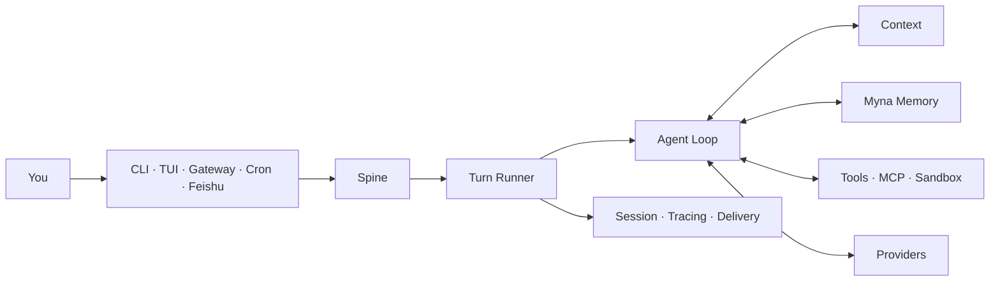

<div align="center">

# Pico

### One Agent Runtime. Every place you work.

Run the same tool-using agent in your terminal, native TUI, background Gateway,
scheduled jobs, and messaging channels without losing Session, Context, Memory,
or evidence.

[](https://github.com/Hackerismydream/pico/actions/workflows/ci.yml)


[Quick start](#from-zero-to-a-real-reply) · [Feishu](docs/onboarding/feishu.zh-CN.md) ·
[Agent install contract](docs/onboarding/agent-install.md) · [中文](README.zh-CN.md)

</div>

---

Pico is a compact Agent Harness, not a chat wrapper and not a Coding Agent.
Every host submits the same Turn through the same Runtime. Myna plugs into that
Runtime as repository Memory; optional Evolver runs produce reviewable evidence
but never activate a candidate without a human decision.



## From zero to a real reply

Pico requires Python 3.12. The installer also provisions a private Node.js 22
runtime when the native TUI needs it.

Current Alpha source install:

```bash
git clone https://github.com/Hackerismydream/pico.git
cd pico
./install.sh

cd /path/to/your-project
pico onboard --skip-memory
```

The wizard now follows the shortest honest path to value:

```text
LLM credentials -> Myna ready or explicitly off -> first real Turn
                -> optional Sandbox -> optional Feishu/channel
```

When a release publishes compatible `pico_harness` and `myna_memory` wheels,
`install.sh` and `install.ps1` pair them into the same `uv tool` environment.
Until that paired artifact exists, install a trusted Myna wheel separately or
use `--skip-memory`; Pico will not silently pretend Memory is available.

After onboarding:

```bash
pico                               # native TUI
pico run -m "Map the main request path in this repository"
pico doctor --probe                # static checks + one real model reply
```

See the [first-use guide](docs/onboarding/README.zh-CN.md) for the paired-wheel
path, non-interactive setup, Myna consent boundary, and exact acceptance checks.

## Why it feels different

| What you need | What Pico owns |
| --- | --- |
| One agent across surfaces | CLI, TUI, Gateway, Cron, and Channels share one Turn contract |
| Context that does not become a prompt dump | budgeted Context assembly before every model call |
| Repository Memory with provenance | Myna binding, Source Journal, capture, Recall, and fail-closed health |
| Tools you can actually govern | Filesystem, Shell, Web, MCP, messaging, and Subagents share confirmation and Sandbox boundaries |
| Debuggable outcomes | Session JSONL, Tracing, usage, delivery status, and evidence Gates stay distinct |
| Improvement without silent mutation | Evolver candidates require evaluation, explicit activation, and rollback evidence |

## Feishu in one path

Pico uses Feishu's WebSocket long connection, so you do not need a public IP or
webhook domain.

```bash
pico channels enable feishu \
  --app-id "cli_xxxxxxxxxxxxxxxx" \
  --app-secret "$FEISHU_APP_SECRET"

cd /path/to/your-project
pico gateway --workspace "$PWD" --verbose
```

The Feishu app still needs bot capability, message permissions,
`im.message.receive_v1`, and a published application version. Follow the
[click-by-click Feishu guide](docs/onboarding/feishu.zh-CN.md) before declaring
the channel connected. A config write is not a live send/receive result.

## Commands worth remembering

| Goal | Command |
| --- | --- |
| Configure and prove first use | `pico onboard` |
| Open the native TUI | `pico` |
| Execute one Turn | `pico run -m "..."` |
| Diagnose Runtime and Provider | `pico doctor --probe` |
| Inspect installed Plugins | `pico plugins` |
| Manage Feishu, QQ, and WeCom | `pico channels ...` |
| Serve enabled Channels | `pico gateway --workspace /path/to/project` |
| Manage scheduled work | `pico cron ...` |
| Inspect Sessions and Tracing | `pico sessions ...` / `pico tracing` |
| Run human-controlled evolution | `pico evolve check\|run\|status\|finalize` |

## State and security

| Scope | Default location |
| --- | --- |
| Global configuration and Runtime data | `~/.pico` |
| Foreground project | current directory |
| Foreground project state | `~/.pico/projects/<project-id>` |
| Gateway Workspace | explicit `--workspace`, otherwise `~/.pico/workspace` |
| Myna repository binding | selected by Myna setup inside the Git common directory |

Normal startup keeps Pico state outside the repository. Myna onboarding shows
its planned writes before consent and does not import history or install Hooks.
For a complete operational handoff, read the
[Myna guide](docs/onboarding/memory.zh-CN.md) and
[troubleshooting guide](docs/onboarding/troubleshooting.md).

## Build and verify

```bash
make install
make ci
```

Start with the [documentation index](docs/INDEX.md),
[architecture overview](docs/architecture/README.md), and
[developer guide](docs/dev.md). Capability claims and their evidence classes
live in [feature evidence](docs/feature-evidence.md) and
[project status](docs/project-status.md).

Pico is pre-1.0. Interfaces can change, and Beta surfaces need stronger Gates
before release. `make ci` is the fast development Gate, not complete release
acceptance.

## License

Apache License 2.0. See [LICENSE](LICENSE), [NOTICES.md](NOTICES.md), and
[LICENSES/](LICENSES/) for authoritative attribution.
