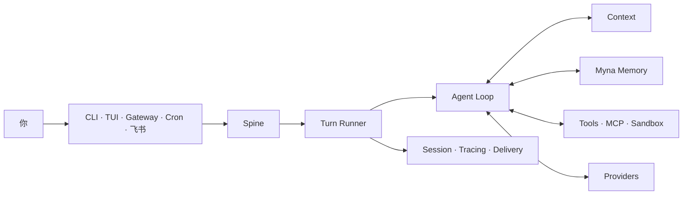

<div align="center">

# Pico

### 一套 Agent Runtime，跟你去每个工作入口。

在终端、原生 TUI、后台 Gateway、定时任务和飞书中运行同一个会用工具的 Agent，
工作换了入口，Session、Context、Memory 和证据不断。

[](https://github.com/Hackerismydream/pico/actions/workflows/ci.yml)


[快速开始](#从零到第一条真实回复) · [飞书接入](docs/onboarding/feishu.zh-CN.md) ·
[Agent 安装合同](docs/onboarding/agent-install.md) · [English](README.md)

</div>

---

Pico 是紧凑的 Agent Harness，不是给 API 套一层聊天壳，也不是 Coding Agent。
每个入口都向同一套 Runtime 提交 Turn。Myna 作为仓库记忆接入；可选的
Evolver 只产生可评审候选与证据，没有人类决定就不激活。



## 从零到第一条真实回复

Pico 需要 Python 3.12。原生 TUI 需要 Node.js 22，缺少时安装脚本会配置私有 runtime。

当前 Alpha 版本的源码安装：

```bash
git clone https://github.com/Hackerismydream/pico.git
cd pico
./install.sh

cd /path/to/your-project
pico onboard --skip-memory
```

新向导按最短的真实价值路径排序：

```text
LLM 凭证 -> Myna 已就绪或明确关闭 -> 第一条真实 Turn
         -> 可选 Sandbox -> 可选飞书/其他渠道
```

当 release 同时发布兼容的 `pico_harness` 与 `myna_memory` wheel 时，
`install.sh` 和 `install.ps1` 会把它们装到同一个 `uv tool` 环境。成对制品
尚未发布时，请安装可信的 Myna wheel，或使用 `--skip-memory`。Pico 不会
把缺失的 Memory 伪装成可用。

向导完成后：

```bash
pico                               # 原生 TUI
pico run -m "说明这个仓库的主请求路径"
pico doctor --probe                # 静态检查 + 一次真实模型回复
```

[首次使用指南](docs/onboarding/README.zh-CN.md) 包含成对 wheel、非交互配置、Myna 授权边界和精确验收命令。

## 它与普通 Agent 壳子的区别

| 你需要什么 | Pico 负责什么 |
| --- | --- |
| 一个 Agent 跨多个入口 | CLI、TUI、Gateway、Cron 和 Channels 共用 Turn 契约 |
| Context 不变成 prompt 垃圾场 | 每次模型调用前检索并预算 Context |
| 带来源的仓库记忆 | Myna 负责绑定、Source Journal、捕获与 Recall，异常时 fail closed |
| 可管的工具 | Filesystem、Shell、Web、MCP、消息和 Subagent 共用确认与 Sandbox 边界 |
| 出问题后能追 | Session JSONL、Tracing、用量、Delivery 状态和证据 Gate 分开记录 |
| 改进不等于静默改自己 | Evolver 候选需要评测、显式激活与回滚证据 |

## 一条路径接入飞书

Pico 使用飞书 WebSocket 长连接，不需要公网 IP 或 webhook 域名。

```bash
pico channels enable feishu \
  --app-id "cli_xxxxxxxxxxxxxxxx" \
  --app-secret "$FEISHU_APP_SECRET"

cd /path/to/your-project
pico gateway --workspace "$PWD" --verbose
```

飞书应用还需要机器人能力、消息权限、`im.message.receive_v1` 和已发布应用版本。
完整步骤见[飞书接入指南](docs/onboarding/feishu.zh-CN.md)。写入配置不等于真实收发通路已成功。

## 值得记住的命令

| 目标 | 命令 |
| --- | --- |
| 配置并证明首次使用 | `pico onboard` |
| 打开原生 TUI | `pico` |
| 执行一次 Turn | `pico run -m "..."` |
| 诊断 Runtime 与 Provider | `pico doctor --probe` |
| 检查已安装 Plugin | `pico plugins` |
| 管理飞书、QQ 和企业微信 | `pico channels ...` |
| 服务已启用 Channel | `pico gateway --workspace /path/to/project` |
| 管理定时任务 | `pico cron ...` |
| 检查 Session 与 Tracing | `pico sessions ...` / `pico tracing` |
| 运行人工受控进化 | `pico evolve check\|run\|status\|finalize` |

## 状态与安全

| 范围 | 默认位置 |
| --- | --- |
| 全局配置与 Runtime 数据 | `~/.pico` |
| 前台项目 | 当前目录 |
| 前台项目状态 | `~/.pico/projects/<project-id>` |
| Gateway Workspace | 显式 `--workspace`，否则 `~/.pico/workspace` |
| Myna 仓库绑定 | Myna 初始化选定的 Git common directory |

正常启动会把 Pico 状态放在仓库之外。Myna 向导会在授权前展示计划写入，
不导入历史，不安装 Hook。可执行 Plugin 只从 Pico 内置目录、operator 管理的
`~/.pico/plugins/` 和已安装的 `pico.plugins` entry point 中发现；仓库里的
`.pico/plugins/` 不会成为自动启动来源。运维交付见 [Myna 指南](docs/onboarding/memory.zh-CN.md)和
[故障排查](docs/onboarding/troubleshooting.md)。

## 开发与验证

```bash
make install
make ci
```

阅读入口包括[文档索引](docs/INDEX.md)、[架构说明](docs/architecture/README.md)和[开发指南](docs/dev.md)。
当前能力结论与证据等级见[能力证据](docs/feature-evidence.md)与[项目状态](docs/project-status.md)。

Pico 仍处于 pre-1.0。接口可能变化；明确标记为 Beta 的能力需要通过更强的 Gate 才能发布。
`make ci` 是快速开发 Gate，不是完整 release 验收。

## 许可证

Apache License 2.0。权威归因见 [LICENSE](LICENSE)、[NOTICES.md](NOTICES.md) 和 [LICENSES/](LICENSES/)。
