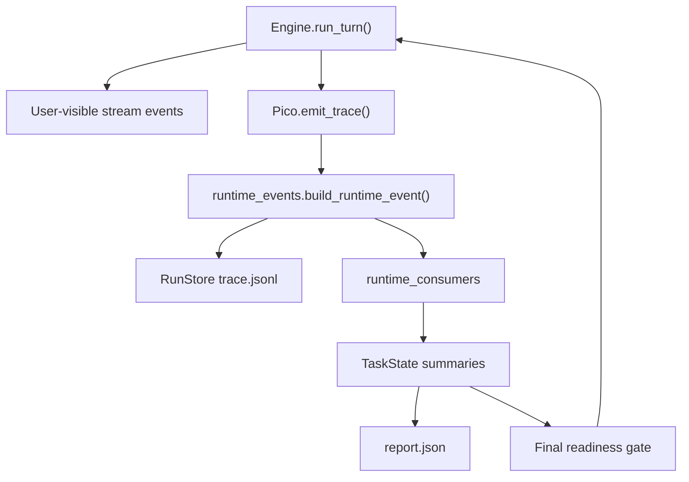

# Pico v3 Agent Loop Architecture Plan

Date: 2026-06-08

Status: implemented on branch `codex/v3-agent-loop-control-plane`

Scope: optimize Pico's agent loop architecture without rewriting the runtime as a full state machine.

## Executive Summary

Pico should not turn `Engine.run_turn()` into a large explicit state machine right now. The current loop is simple, but the real weakness is not that it lacks more states. The weakness is that important runtime decisions are implicit: loop transitions, context pressure, governance decisions, verification readiness, and final-answer readiness are scattered across stream events, trace events, session events, task state, and report output.

The right direction is a trace-native control plane around the existing generator loop:

1. Keep the user-visible stream stable.
2. Add a typed transition contract for real loop control-flow decisions.
3. Route evidence through `emit_trace()`, `runtime_consumers`, and `TaskState`.
4. Make reports a snapshot of `TaskState`, not a second parser over raw trace files.
5. Treat microcompact as prompt render-time projection, not session history mutation.
6. Add a soft final readiness gate that is traceable, deduplicated, and configurable.

In short: use state-machine thinking as a data model, not as the first implementation shape.

## Current Diagnosis

Pico's current agent loop is a generator loop, not a formal state machine.

That is acceptable. The loop already has clear operational phases:

- build prompt
- call model
- parse model output
- execute tools
- continue or finish
- persist trace and task state
- build run report

The problem is that these phases are not represented as a coherent control plane. Some decisions appear as stream events, some as trace events, some as session events, and some only as side effects on `TaskState`.

The current code also has tight module budgets:

- `pico/core/engine.py`: 453 lines, budget 470
- `pico/core/runtime.py`: 939 lines, budget 950
- `pico/core/context_manager.py`: 395 lines, budget 420
- `pico/core/task_state.py`: 124 lines, budget 140

This means the architecture must add small modules and thin call sites. Adding more helper logic directly into `engine.py` or `runtime.py` will quickly violate the existing entropy budget.

## Design Principle

The agent loop should remain readable:

```text
prompt -> model -> parse -> tools -> continue/final
```

The harness control plane should become explicit:

```text
runtime event -> trace -> consumer -> TaskState summary -> report/final gate
```

This keeps the loop easy to understand while making decisions auditable.

## Target Architecture



Key invariant:

> Raw evidence is appended to trace, interpreted by consumers, stored as compact summaries in `Task_state`, and surfaced by report/final-gate logic.

Do not make `report.json` parse `trace.jsonl` directly. Do not make final readiness depend on report generation.

## Non-Goals

This plan deliberately avoids:

- rewriting `Engine.run_turn()` into a full state-machine executor
- changing user-visible stream event order
- replacing `TaskState.stop_reason`
- reading `trace.jsonl` inside `build_report()`
- direct calls to `run_store.append_trace()` from new loop helpers
- mutating `session["history"]` for microcompact
- requiring Python 3.11 features such as `StrEnum`
- introducing multi-agent orchestration into the core loop

## Proposed Modules

### `pico/core/turn_transitions.py`

Owns loop transition contracts and summary reduction.

Responsibilities:

- define Python 3.10-compatible enums via `class X(str, Enum)`
- define transition payload construction
- reduce transition events into `transition_summary`
- keep reason vocabulary aligned with `TaskState.stop_reason`

This module keeps transition logic out of `engine.py`.

### `pico/core/evidence_summaries.py`

Optional small module if `runtime_consumers.py` would exceed budget.

Responsibilities:

- reduce context evidence
- reduce governance evidence
- reduce verification evidence
- reduce final readiness decisions

If the implementation remains small, this can be folded into `runtime_consumers.py`; otherwise split it.

### `pico/core/final_readiness.py`

Owns final answer readiness evaluation.

Responsibilities:

- inspect `TaskState`
- compute readiness decision
- deduplicate soft reminders
- enforce mode semantics: `off`, `warn`, `soft`, `strict`

This module should not know about prompt rendering or provider calls.

### `pico/core/tool_result_index.py`

Optional module for artifact-backed microcompact.

Responsibilities:

- persist full tool result artifacts when a result may be stubbed
- map history item or event id to `artifact_ref`
- record `original_chars`, `hash`, `tool_name`, `span_id`, and `changed_paths`

This avoids pretending that clipped trace payloads are sufficient for recovery.

## Data Model

### Loop Transition Event

Event name: `loop_transition`

Written only through:

```python
agent.emit_trace(task_state, "loop_transition", payload)
```

Never write this with `run_store.append_trace()` directly.

Example payload:

```json
{
  "kind": "continue",
  "reason": "tool_batch_executed",
  "turn_index": 2,
  "attempt_index": 2,
  "tool_call_count": 2,
  "stream_event_boundary": {
    "before": "tool_result",
    "after": "model_requested"
  }
}
```

Terminal payload:

```json
{
  "kind": "terminal",
  "reason": "final_answer_returned",
  "turn_index": 3,
  "attempt_index": 3,
  "stop_reason": "final_answer_returned"
}
```

Invariant:

- each run may have many `continue` transitions
- each run may have at most one `terminal` transition
- terminal `stop_reason` must match or explicitly map to `TaskState.stop_reason`

### Transition Summary

Stored under `TaskState`, surfaced in report.

Example:

```json
{
  "continue_count": 3,
  "terminal_count": 1,
  "terminal_reason": "final_answer_returned",
  "reasons": {
    "tool_batch_executed": 2,
    "parse_retry": 1,
    "final_answer_returned": 1
  },
  "max_attempt_index": 4
}
```

### Context Budget Summary

Use one summary object instead of separate `context_summary` and `microcompact_summary`.

Example:

```json
{
  "estimated_tokens": 6120,
  "effective_window": 8192,
  "reserved_output_tokens": 1024,
  "pressure_ratio": 0.85,
  "reductions": [
    {
      "source": "section_reduction",
      "section": "turn_history",
      "saved_chars": 1830
    },
    {
      "source": "microcompact",
      "section": "tool_result",
      "saved_chars": 4200,
      "artifact_refs": ["artifacts/tool-results/abc.json"]
    }
  ],
  "prompt_changed_by_phase_3": false
}
```

Phase 3 must prove the prompt string does not change. Phase 5 may change prompt rendering through microcompact, but only after artifact-backed recovery exists.

### Governance Decision

Event name: `governance_decision`

This is a per-run trace/report side channel. Existing session events should remain for interactive compatibility.

Example:

```json
{
  "decision": "deny",
  "decision_type": "tool_policy",
  "reason_code": "read_only_violation",
  "tool_name": "write_file",
  "turn_index": 1,
  "span_id": "span_123",
  "source": "tool_executor"
}
```

Allowed `decision` values:

- `allow`
- `deny`
- `warn`

Do not put execution outcomes such as `partial_success` in `decision`. Execution result belongs in `tool_executed.status` or related evidence.

Reason mapping should cover early exits:

| Current condition | Governance reason |
| --- | --- |
| unknown tool | `unknown_tool` |
| invalid args | `invalid_arguments` |
| repeated identical call | `repeated_identical_call` |
| read-only approval denied | `read_only_violation` |
| sandbox unavailable when required | `sandbox_rejected_command` |
| policy denied | existing policy reason |
| permission denied | existing permission reason |

### Verification Signal

This must not be a boolean.

Example:

```json
{
  "state": "passed",
  "source_span_id": "span_456",
  "command": "uv run pytest tests/test_engine_acceptance.py -q",
  "last_workspace_change_span_id": "span_410",
  "covers_changed_paths": true,
  "verified_at": "2026-06-08T14:00:00Z"
}
```

Allowed states:

- `missing`
- `passed`
- `failed`
- `not_required`

Rules:

- a successful verification before the last workspace change is stale
- a verification command must be recognizable as test/build/lint/typecheck/compile
- later file changes invalidate the previous signal unless explicitly scoped
- verifier suggestions are not verification evidence

### Final Readiness Decision

Event name: `final_readiness_decision`

Example:

```json
{
  "mode": "soft",
  "decision": "remind",
  "reason_signature": "changed_paths_without_verification:abc123",
  "reasons": ["changed_paths_without_verification"],
  "reminder_already_sent": false,
  "action": "runtime_notice"
}
```

Mode semantics:

| Mode | Behavior |
| --- | --- |
| `off` | no check |
| `warn` | record only, no runtime notice |
| `soft` | inject one runtime notice per reason signature |
| `strict` | block high-risk final answer |

Soft mode must deduplicate by `reason_signature`.

If the model tries to final again with the same unchanged issue:

- `soft`: allow final, record warning
- `strict`: stop with `final_gate_blocked`

This avoids reminder loops.

## Implementation Plan

### Phase 0: Golden Stream Baseline

Goal: freeze user-visible stream behavior before adding control-plane evidence.

Files likely touched:

- `tests/test_engine_acceptance.py`
- new focused tests if existing file becomes crowded

Coverage:

1. final-only path
2. tool batch path
3. parse retry path
4. provider error path
5. step limit path

Important constraint:

- collect only events yielded by `Engine.run_turn()`
- do not mix trace-only events such as `prompt_built` into stream golden tests

Acceptance:

- stream event order remains unchanged
- no production code changes required in this phase

### Phase 1: Transition Contract

Goal: define loop transition schema and reducer without wiring it into the engine yet.

Files likely touched:

- `pico/core/turn_transitions.py`
- `tests/test_turn_transitions.py`
- `tests/test_architecture_boundaries.py`

Implementation notes:

- use `class TransitionKind(str, Enum)`, not `StrEnum`
- keep all summary logic out of `engine.py`
- add line budget for the new module

Acceptance:

- transition payload can be constructed deterministically
- summary reducer enforces at most one terminal transition
- terminal reason vocabulary aligns with `TaskState.stop_reason`

### Phase 2: Engine Transition Trace

Goal: instrument real loop control-flow decisions without changing stream output.

Files likely touched:

- `pico/core/engine.py`
- `pico/core/runtime_events.py`
- `pico/core/runtime_consumers.py`
- `pico/core/task_state.py`
- `tests/test_engine_acceptance.py`
- `tests/test_run_evidence.py`

Only record real loop transitions:

- parse retry
- provider retry
- tool batch executed
- plan-mode runtime notice continue
- final answer returned
- abort
- provider error
- step limit reached

Do not record context pressure, auto compact, or checkpoint events as loop transitions.

Acceptance:

- stream golden tests from Phase 0 still pass
- `trace.jsonl` contains `loop_transition`
- `TaskState.transition_summary` is updated by consumer
- report surfaces transition summary from `TaskState`
- existing `TaskState.stop_reason` remains backward compatible

### Phase 3: Context Evidence Without Prompt Changes

Goal: make context pressure and existing compaction behavior visible without changing prompt rendering.

Files likely touched:

- `pico/core/context_manager.py`
- `pico/core/runtime.py`
- `pico/core/runtime_consumers.py`
- `pico/core/task_state.py`
- `tests/test_context_manager.py`
- `tests/test_run_evidence.py`

Implementation notes:

- derive evidence from existing prompt metadata, compaction metadata, and checkpoint events
- do not introduce new compaction behavior
- do not change `ContextManager.build()` prompt output
- aggregate into `context_budget_summary`

Acceptance:

- prompt string before and after Phase 3 is identical for matched fixtures
- report explains context pressure and existing reductions
- no new history mutation

### Phase 4: Governance Decision Record

Goal: make tool governance decisions per-run, reportable, and usable by final readiness.

Files likely touched:

- `pico/core/tool_executor.py`
- `pico/core/permissions.py`
- `pico/core/tool_policy.py`
- `pico/core/runtime_consumers.py`
- `pico/core/task_state.py`
- `tests/test_tool_policy_acceptance.py`
- `tests/test_tool_validation.py`
- `tests/test_run_evidence.py`

Implementation notes:

- keep current session events for UI compatibility
- add per-run `governance_decision` trace events
- cover early returns before permission/policy checks
- map current reason codes into stable governance reason codes

Acceptance:

- unknown tool, invalid args, repeated call, read-only block, sandbox unavailable, permission deny, and policy deny all produce governance evidence
- governance summary is available in `TaskState` and report
- execution outcome remains separate from governance decision

### Phase 5: Artifact-Backed Microcompact

Goal: reduce prompt pressure for long historical tool results while preserving exact recoverability.

Files likely touched:

- `pico/core/turn_history.py`
- `pico/core/artifacts.py`
- optional `pico/core/tool_result_index.py`
- `pico/core/runtime_consumers.py`
- `tests/test_context_manager.py`
- `tests/test_run_evidence.py`

Implementation notes:

- microcompact is render-time projection only
- never mutate `session["history"]`
- before stubbing a tool result, persist the full source as a tool-result artifact
- trace should store only references and metadata, not full large payloads
- reuse existing `TurnHistoryBuilder` summarization before adding new compression rules

Retention rules:

- keep recent window unmodified
- keep last failed tool result unmodified
- keep last workspace-changing tool result unmodified
- keep results tied to current `changed_paths` unmodified unless safely indexed
- stub older large read/search/list outputs only after artifact persistence

Acceptance:

- original result can be recovered by artifact ref
- prompt shrinks on long-output fixtures
- session history remains byte-for-byte unchanged except for separately indexed metadata if needed
- context budget summary reports saved chars and artifact refs

### Phase 6: Soft Final Readiness Gate

Goal: prevent premature final answers without turning Pico into a brittle blocker.

Files likely touched:

- `pico/core/final_readiness.py`
- `pico/core/engine.py`
- `pico/core/task_state.py`
- `pico/core/runtime_consumers.py`
- `tests/test_engine_acceptance.py`
- `tests/test_todo_ledger_acceptance.py`
- `tests/test_run_evidence.py`

Default mode:

- start with `warn` or `soft`
- do not default to `strict`

Checks:

- changed paths without fresh verification
- failed verification after last workspace change
- unresolved current-run high-priority todo
- governance denial in current run
- context pressure over hard threshold without successful reduction

Run scoping:

- todo readiness must use current run evidence, not the entire session ledger
- use `task_state.todo_changes` or `updated_at >= run_started_at`

Acceptance:

- final readiness decision is traceable
- soft reminder is sent at most once per reason signature
- second unchanged final in soft mode is allowed with warning
- strict mode blocks only clearly high-risk final answers

## Recommended Delivery Units

This should not land as one large PR.

Recommended sequence:

1. PR 1: Phase 0 + Phase 1
2. PR 2: Phase 2 transition trace and summary
3. PR 3: Phase 3 context evidence
4. PR 4: Phase 4 governance evidence
5. PR 5: Phase 5 artifact-backed microcompact
6. PR 6: Phase 6 final readiness gate

Each PR should preserve stream golden tests.

## Test Strategy

Avoid bare `pytest` from the repo root. This repository has local worktrees, artifacts, and release material that can pollute collection if the command is too broad.

Use focused tests during development:

```bash
uv run pytest tests/test_engine_acceptance.py -q
uv run pytest tests/test_run_evidence.py -q
uv run pytest tests/test_context_manager.py -q
uv run pytest tests/test_tool_policy_acceptance.py tests/test_tool_validation.py -q
uv run pytest tests/test_todo_ledger_acceptance.py -q
```

Use source-scoped full checks before landing:

```bash
uv run pytest tests -q
uv run ruff check pico tests scripts
git diff --check
```

If collection pollution appears, scope the command explicitly rather than treating it as a product regression.

## Architecture Guardrails

### Stream Compatibility

No new user-visible event should appear in the stream unless explicitly approved. Trace events are the right place for new control-plane evidence.

### Emit Path

All new run evidence should go through:

```python
agent.emit_trace(task_state, event_name, payload)
```

This preserves:

- redaction
- standard event envelope
- span ids
- runtime consumers
- task state persistence

### Summary Source

Reports should snapshot `TaskState`; they should not parse raw trace files.

### Reason Vocabulary

Do not create parallel names for existing stop reasons. Either reuse `TaskState.stop_reason` values or maintain an explicit mapping test.

### Context Semantics

Context pressure is not a loop transition.

Context evidence belongs in `context_budget_summary`; loop transitions belong in `transition_summary`.

### Microcompact Safety

Never stub text unless the original is recoverable from an artifact.

Never mutate session history for microcompact.

### Final Gate Safety

Final readiness must be advisory first. Use strict mode only after warn/soft mode has enough evidence from real runs.

## Open Questions Before Implementation

These are engineering decisions to settle during implementation, not blockers for the architecture direction.

1. Should `TaskState` store one generic `evidence_summaries` dict, or typed fields such as `transition_summary`, `context_budget_summary`, `governance_summary`, and `verification_signal`?
2. Should tool-result artifact indexing be a standalone module or an extension of existing `artifacts.py`?
3. How strict should verification command recognition be in v1?
4. Should final readiness mode be configured globally, per run, or per task profile?
5. Should Phase 5 write non-sensitive metadata into history items, or keep a separate event-id index?

My default answers:

1. Use typed fields if line budgets allow; otherwise use a generic dict with typed reducer helpers.
2. Start in `artifacts.py` only if small; split once artifact indexing gains lookup logic.
3. Start conservative: pytest, ruff, mypy/pyright, build, compileall, npm test/build equivalents.
4. Configure globally first, allow per-run override later.
5. Prefer a separate index to avoid changing history shape until necessary.

## Final Recommendation

Adopt GPT Pro's high-level direction, but narrow it into this architecture:

> Keep the generator loop. Add a typed harness control plane around it.

This gives Pico the useful properties of a state-machine agent loop:

- explicit transitions
- auditable decisions
- recoverable context compression
- final readiness checks
- reportable governance and verification

without paying the cost of rewriting the core engine into a brittle state machine too early.
