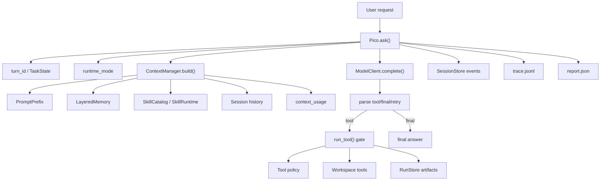

# Pico v4 架构说明

这份文档记录当前 Pico v4 的真实实现边界。它不是把 Pico 包装成 Claude Code 的简化版，而是把本地 coding agent 最容易被问穿的几条链路补完整：上下文怎么装箱，运行过程怎么留证据，工具为什么能控，技能怎么进入 prompt，以及模型接入如何保留不同 provider 的能力差异。

## 总体结构



Pico 的核心仍然是一个单线程 agent loop。每轮请求会先创建 `turn_id` 和 `TaskState`，然后组 prompt、请求模型、解析输出、执行工具或返回最终答案。v4 没有把主循环拆成复杂框架，而是在关键边界补了结构化协议，让这个 loop 能被解释、恢复和评测。

## Context：从拼字符串变成可观测装箱

v4 的 prompt 顺序是：

```text
prefix -> memory -> skills -> relevant_memory -> history -> current_request
```

`current_request` 仍然永远保留。`skills` 采用渐进式披露：有本地 skill 时先进入 `Available skills` 摘要；摘要不够时模型可以调用 `list_skills` 检索目录；只有用户 slash 调用或模型调用 `load_skill` 时才加载完整正文。已加载的 inline skill 是受保护 section，不会被普通预算静默裁掉。首轮 prompt 不再把当前用户输入同时放进 `history` 和 `current_request`，避免用户只说 `hi` 时也出现重复上下文。

`pico/features/context_usage.py` 负责把 char 级预算映射成 token 级估算。它会在 `last_prompt_metadata["context_usage"]` 和 `report.json` 里记录：

- `estimated_prompt_tokens`
- `model_context_window_tokens`
- `reserved_output_tokens`
- `available_prompt_tokens`
- `section_estimated_tokens`
- `budget_status`

这让 Pico 能回答面试里的具体追问：一个空 session 输入 `hi` 时，prompt 里有哪些 section，各自大概占多少 token，当前模型窗口还剩多少。

`compact_history()` 把旧 history 压成一条 `[compacted context]` 摘要，并保留最近若干条消息。TUI 和 REPL 都暴露 `/compact [n]`，压缩结果会写回 session JSON，同时追加 `history_compacted` session event。这个设计先用本地可解释摘要解决恢复和上下文预算问题，后续可以把摘要生成器替换成模型总结，而不改变 session 结构。

## Trace / Session：运行证据和可恢复状态分开

Pico v4 保留三类 run 产物：

- `.pico/runs/<run_id>/task_state.json`
- `.pico/runs/<run_id>/trace.jsonl`
- `.pico/runs/<run_id>/report.json`

同时新增 session 事件流：

```text
.pico/sessions/<session_id>.events.jsonl
```

旧的 session JSON 仍然保存可恢复状态，新的 events JSONL 保存审计时间线。这样做的原因是两类数据生命周期不同：session JSON 要便于恢复，events JSONL 要便于追加、回放和后续导出。

trace 现在带 `trace-v2` envelope：

- `trace_id`
- `span_id`
- `parent_span_id`
- `turn_id`
- `phase`
- `status`
- `sequence`
- `created_at`

这不是完整 OpenTelemetry，但已经能把一次运行拆成 run、context、model、tool、checkpoint 等阶段。后面如果要接 Langfuse、OTel 或自研可视化，只需要写 exporter，不需要再改主循环事件结构。

## Tool Policy：工具不只是 schema

v4 给每个工具补了 protocol 和 policy。protocol 是工具对 runtime/TUI/trace 暴露的稳定字段，policy 是 runtime 执行前的约束。

工具 protocol 包含：

- `schema`
- `description`
- `risky`
- `read_only`
- `activity`

工具 policy 包含：

- `read_only`
- `concurrency`
- `requires_prior_read`
- `records_read`
- `max_result_chars`

运行时的工具闸口顺序是：

```text
allowed_tools -> tool schema -> runtime mode -> prior read policy -> repeated call guard -> approval/read_only -> execute -> artifact/memory/policy update
```

`allowed_tools` 可以限制一个 session 里暴露哪些工具，benchmark 也会把任务里的 `allowed_tools` 真正传给 runtime。`patch_file` 现在要求目标文件先经过 `read_file`，并用文件 freshness 检查这次 read 是否仍然有效。这个策略解决的是面试里常被问的文件修改安全：Agent 不能在没看过当前文件内容时直接 patch。

长工具结果不再只裁剪。超过工具 policy 的 `max_result_chars` 后，Pico 会把完整结果写入：

```text
.pico/runs/<run_id>/tool_artifacts/<index>-<tool>.txt
```

history 和 trace 里保留裁剪结果加 artifact 指针。这样模型不会被长 stdout 撑爆上下文，人也能回到完整证据。

## Plan Mode：把探索和执行分成两个运行状态

Pico 现在有两个 runtime mode：

```text
execute
plan
```

`/plan [topic]` 会创建 `.pico/plans/<id>.md`，把 `runtime_mode` 写入 session，并把 plan 文件路径注入 prefix。计划模式下允许 `list_files`、`read_file`、`search`、`delegate` 等只读工具；写工具只能写当前 active plan 文件。`/execute` 退出计划模式，恢复正常执行。

这不是一个 UI 命令，而是 harness 状态。它改变 prompt、session identity 和工具闸口，能回答面试里“从底层如何设计”“tool policy 怎么防止模型直接乱改文件”的追问。

## Subagent：受限 worker，不是失控多 agent

Pico 现在有一层轻量 subagent 控制面：

```text
agent -> SubagentManager -> Explore / Worker -> subagent notification -> coordinator history
```

`Explore` 是只读调查 agent，只暴露 `list_files`、`read_file`、`search`、`run_shell` 和 `todo_list`。它适合开放性代码搜索和架构理解。

`Worker` 是受限实现 agent，必须带 `write_scope`。`write_file`、`write_files` 和 `patch_file` 如果目标路径不在 scope 内，会在 runtime gate 被拒绝。Worker 写完以后也不能绕过主 agent 的 completion gate；最终完成仍然由主 `Pico.ask()` 判断。

子 agent 结果不会直接变成最终答案，而是通过 `<subagent-notification>` 回流主会话，同时写入：

- `TaskState.subagents`
- `trace.jsonl`
- `report.json`
- session event
- TUI `/agents`

这个设计参考了 `cc-mini` 的 coordinator mode，但没有照搬成一个大框架。Pico 保持一个主 coordinator：worker 可以查、写、验证，理解和综合必须回到主 agent。

## Skill：本地技能系统和渐进式披露

v4 的 skill catalog 扫描两个位置：

```text
.pico/skills/*/SKILL.md
skills/*/SKILL.md
```

每个 `SKILL.md` 可以带 frontmatter：

```markdown
---
name: pytest
description: Run focused pytest coverage.
when_to_use: Python test work.
triggers: pytest, tests
argument-hint: target
context: inline
---
```

Skill 进入 prompt 分四层：

- L0：prefix 记录 `skill_signature` 和 skill 数量，避免 resume/cache 复用旧能力面。
- L1：`skills` section 只放 `Available skills` 摘要：名称、描述、适用场景和来源；摘要预算省略时，模型可以用 `list_skills(query,limit)` 检索完整目录摘要。
- L2：用户输入 `/skill:<name> [args]` 或模型调用 `load_skill(name,args)` 时，`SkillRuntime` 才加载完整正文，替换 `$ARGUMENTS` 和 `${PICO_SKILL_DIR}`。
- L3：skill 目录下的 examples/scripts/templates 不会自动塞入 prompt，只通过 `Base directory for this skill` 暴露给后续工具读取。

旧的 `triggers` 仍然会进入 metadata 的 `legacy_matches`，但不再直接触发正文注入。真正的调用会写入 session event `skill_invoked`，并进入 prompt metadata 的 `skills.invoked`。

`context: inline` 会把 skill 正文作为本轮上下文，并在 ContextManager 里保护完整正文，确保 `think` 这类长 skill 被显式加载后不会只剩头部片段。`context: fork` 会走已有 subagent runtime，在隔离的 Explore 子任务里执行 skill 指令；父 agent 只记录结果和 `skill_invoked` 事件，不把 fork skill 正文回灌到父 prompt。这个设计保留本地 Markdown skill 的低门槛，同时避免把 skill 变成无边界的插件市场。

## SDK / Provider Capability：HTTP 兼容和官方 SDK 并存

模型层仍然只向 runtime 暴露一个接口：

```python
complete(prompt, max_new_tokens, **kwargs) -> str
```

v4 新增 `AnthropicSDKModelClient`，CLI 可以用：

```bash
pico --provider anthropic-sdk
```

它使用官方 `anthropic` Python SDK 的 `messages.create`，同时保留原来的 `AnthropicCompatibleModelClient`。Anthropic 官方文档说明，使用 SDK 时 API key 在 client 构造阶段设置，SDK 会负责后续请求认证；Messages API 是 SDK 的核心调用面。参考：[Anthropic API overview](https://docs.anthropic.com/en/api/overview)、[Anthropic Client SDKs](https://docs.anthropic.com/en/api/client-sdks)。

这条设计符合 right.codes 的使用方式：OpenAI-compatible 的 codex endpoint 继续走 OpenAI-compatible client；Claude endpoint 如果兼容 Anthropic Messages API，可以走 HTTP client，也可以走 Anthropic SDK client。SDK 作为可选 extra 存在，不会把整个 Pico 绑定到某一家 provider。

## 当前没有做的事

v4 已经把核心链路落地，但还有几个边界没有假装完成：

- context compact 目前是本地摘要，不是模型生成的语义压缩
- session 事件是线性 JSONL，还不是完整 tree/fork
- trace 是 span-like 本地 schema，还没有 exporter
- tool policy 已有 prior-read、allowed-tools 和 plan mode，但还没有 hook 链和 deny/allow rule DSL
- skill 仍然是本地 Markdown 资源，还没有 remote marketplace、安装器或 MCP skill

这些留白是后续优化方向，也是面试里可以主动说明的工程边界。
