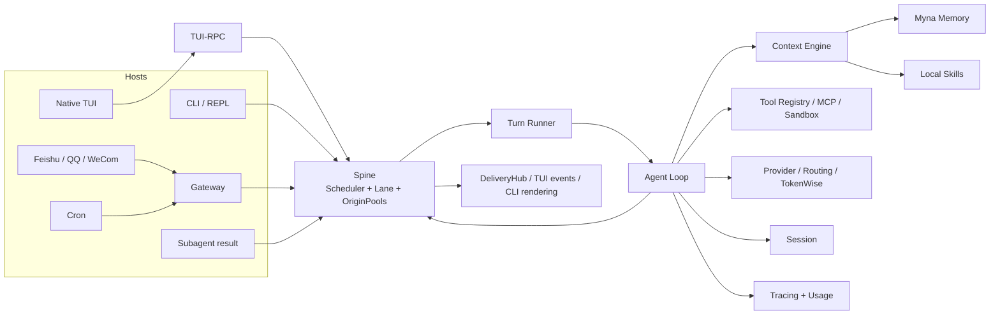

# Pico architecture

Pico is a general Agent Harness. Its primary architectural promise is that all
execution surfaces use one Runtime and one Turn model instead of growing
surface-specific Agent Loops.

This page defines system boundaries, package ownership, dependency direction,
and lifecycle responsibilities. Follow the linked detail pages for control
flow, persistence, operations, and Evolver.

## System boundary



Hosts own interaction policy and output adapters. Runtime Assembly owns the
shared Config-derived Agent composition. Spine owns ordering, cancellation, and
Turn lifecycle. Agent Loop owns one Turn's LLM/Tool work. Session, Curator,
Myna, Tracing, and Evolver artifacts are separate persistence domains,
not one database transaction.

## Architectural invariants

1. **One Turn path.** CLI, TUI, Gateway, Channel, Cron, and Subagent-origin work
   become `TurnRequest` values and flow through Spine.
2. **Dependency inversion at Spine.** `pico.spine` defines `TurnRunner`;
   `pico.agent` implements `AgentTurnRunner`. Spine never imports Agent Loop.
3. **One Context Engine.** `ContextAssembler` owns the prompt pipeline. The old
   `legacy`, `default`, and `curator` engine choice no longer exists; the
   Curator is segment 6.
4. **Transcript truth stays in Session.** Curator archives and Myna
   indexes help selection and recall but do not replace the append-only Session
   record.
5. **Memory is explicit and fail-closed.** `memory.backend = null` disables
   Memory. A selected backend that cannot construct, start, recall, or store
   does not silently disappear.
6. **Delivery is outside the Agent Loop.** The runner emits typed events; hosts
   decide how to render or send them.
7. **Optional integrations stay lazy.** Channel and Sandbox extras should not
   become base imports. Missing one Channel SDK must not disable the others.
8. **Evolution does not equal activation.** Candidate generation, evaluation,
   promotion within a run, human readiness, activation, and rollback are
   distinct states.
9. **Evidence keeps its class.** Deterministic, contract, live, fixture,
   historical, skipped, inconclusive, Provider failure, and infrastructure
   failure are not interchangeable.
10. **Pico state is isolated.** Pico does not implicitly import or mutate
    external product state.

## Package map

| Package | Owns | Does not own |
| --- | --- | --- |
| `pico/cli/` | Typer commands, onboarding, host composition, REPL/Gateway/TUI entry points | Agent semantics or platform SDK implementations |
| `pico/spine/` | `TurnRequest`, origins, busy policy, Scheduler, Lane, origin pools, lifecycle events, delivery queues | Provider, Context, or Agent implementation |
| `pico/agent/` | Agent Loop, recovery, Checkpoint, Tools, MCP client, Subagents, personalization, Agent-side Turn Runner | Host UI or Channel SDK lifecycle |
| `pico/tui_rpc/` | JSON-RPC methods, protocol models, TUI-specific Spine outlet and subscriptions | React rendering |
| `ui-tui/` | React/Ink terminal frontend, overlays, client stores, TUI-RPC client | Runtime state or Python imports |
| `pico/channels/` | Channel contract, registry, manager, intake, outbound adapter | Agent Loop or Session persistence |
| `pico/proactive_engine/schedulers/cron/` | Persistent user-scheduled jobs, claims, timezone evaluation, fire records | Sentinel, Heartbeat, or autonomous task discovery |
| `pico/session/` | Session JSONL, resolution, fork, export, deletion, concurrency fences | Long-term semantic Memory |
| `pico/context_engine/` | Ordered prompt segments, token budget, Curator, archive, manifest, working state | Session transcript persistence |
| `pico/memory_engine/` | backend Protocol, local catalog, SkillForge routing, local Memory store, consolidation legacy support | Plugin discovery |
| `pico/plugin/` | manifest discovery, activation registry, and Memory/Tool contributions | Remote marketplace |
| `pico/providers/` | LLM abstraction, provider catalog, LiteLLM/direct adapters, retries, fallback, streaming | Task-level host scheduling |
| `pico/routing/` | Optional model-selection policies and per-model endpoint routing | Provider authentication lifecycle |
| `pico/token_wise/` | LLM-call strategies, cache placement, usage and cost aggregation | Product billing |
| `pico/sandbox/` | direct or BoxLite executor selection, VM lifecycle, debug server | A guarantee that direct host execution is isolated |
| `pico/tracing/` | non-interfering local span facade, semantic conventions, JSONL storage, artifacts, local viewer | Distributed tracing backend or release evidence verifier |
| `pico/evolver/` | Evolution Run lifecycle, benchmark contracts, candidate commits, Gates, sealed evaluation, activation artifacts | Automatic production activation |
| `pico/eval_engine/` | Existing hook and judge implementation | A currently mounted public Runtime feature; Runtime Assembly does not wire it |
| `pico/config/` | base and extension schemas, loading, migrations, atomic updates | Secret management service |
| `pico/security/` | untrusted-content fencing and network trust checks | OS-level isolation |
| `pico/auth/` | OAuth helpers for supported Provider login paths | General identity or tenancy |

Empty ignored cache directories such as `pico/skill_hub/` or
`pico/proactive_engine/sentinel/` are not tracked packages and do not represent
retained capabilities.

## Host composition

`pico/cli/_runtime_assembly.py::assemble_runtime` is one concrete shared
composition, not an abstract framework:

```text
base Config + Pico extension Config
  -> Plugin Registry
  -> selected Memory Backend
  -> plugin-contributed Tools
  -> Session Manager
  -> Agent Loop
  -> RuntimeAssembly
```

Each host then supplies and owns:

- Provider and optional Router construction;
- Cron service placement;
- interactive versus one-shot policy;
- Turn Runner streaming mode;
- Scheduler pool sizes;
- Delivery outlet or TUI event bridge;
- startup timing and shutdown sequence.

`RuntimeAssembly.start_memory_backend()` attempts startup once and caches a
failure. `RuntimeAssembly.close()` closes MCP/Agent resources before stopping
the backend, while recording shutdown errors instead of abandoning later
cleanup.

## Dependency direction

```text
ui-tui -> TUI-RPC protocol -> pico/tui_rpc -> cli composition
channels -> Spine types
cli -> agent + channels + cron + providers + spine
agent -> context + memory contracts + providers + sandbox + spine types
context -> memory contracts + provider abstraction
plugin -> memory/tool contracts
spine -> no agent/provider/context imports
benchmarks -> pico runtime packages
pico runtime packages -X-> benchmarks
```

The Evolver makes one scoped, lazy exception: an Evolution Run may load a
benchmark plugin from `benchmarks/` by registry path because the benchmark is
the subject/evaluation environment. The base Runtime and installed wheel do
not import benchmark code during normal operation.

## Persistence domains

| Domain | Default location | Authority |
| --- | --- | --- |
| Pico global config and runtime data | `~/.pico` | Product configuration and global state |
| Foreground Workspace | Current directory unless overridden | Files and tool execution |
| Foreground Workspace State | `~/.pico/projects/<project-id>` | Bootstrap, Sessions, Memory, local Skills, and Checkpoints |
| Gateway / configured Workspace | `~/.pico/workspace` unless overridden | Fixed Workspace with colocated state |
| Session transcript | `<workspace-state>/sessions/<channel>/<chat_id>.jsonl` | Conversation record |
| Curator state | `<workspace-state>/memory/.curator/` | Context selection archive, manifest, working state |
| Myna | Myna-owned runtime selected by `myna init` | Repository-scoped durable Memory |
| Tracing | `~/.pico/traces/` unless override | Best-effort local observability |
| Cron | Pico global Cron store | Persistent scheduled jobs and fire state |
| Evolution Run | Run-spec `work_dir` | Journal, nodes, trials, sealed results, activation bundles |

These domains have their own durability rules. A successful Session save
followed by a Myna store failure can produce a failed Turn with a durable
transcript but no new repository Memory. Documentation and recovery logic must
not imply cross-domain atomicity.

## Extension boundaries

Supported extension points:

- LLM Providers and custom OpenAI-compatible endpoints;
- MCP servers;
- Plugins contributing Memory backends or Tools;
- local Skills;
- registered Evolver benchmark bundles;
- host-specific delivery outlets behind the retained interfaces.

Not supported:

- remote Plugin or Skill marketplace;
- dynamic TUI command discovery;
- arbitrary Candidate Labels without a label-specific evaluator;
- implicit Provider/Sandbox/Memory fallback that hides selected-component
  failure.

## Current architectural risks

- Gateway delivery retries in memory and does not persist the outbound queue.
  Exhaustion emits a `channel.deliver` span and can publish a
  `DELIVERY_FAILED` notice through an injected sink, but hosts do not yet wire
  that sink. It does not retroactively fail the completed Agent Turn.
- `DeliveryHub.aclose()` cancels outlet workers and does not guarantee an
  in-flight send is flushed.
- Session, Curator, Myna, Tracing, and Evolution Run artifacts are not one
  transaction.
- the direct Sandbox backend executes on the host; workspace and dangerous
  command checks are guardrails, not OS isolation.
- `auto` Sandbox currently means “require a working BoxLite backend,” not
  “select BoxLite or fall back to host execution.”
- Tracing is best effort and local. It is not an OpenTelemetry exporter, and
  shared-directory rotation is not designed as a multi-process ledger.
- the Eval Engine source exists but is not mounted by Runtime Assembly.
- only the `runtime` Candidate Label has an executable Evolver evidence chain.
  AppWorld is the checkout example; PR #56 adds a tracked disposable
  small-real subject and deterministic harness, but no real model outcome.
- current CI is smaller than the release acceptance model.

## Detailed documents

- [Runtime and Turn flow](runtime.md)
- [State, Context, Memory, and Skills](state-and-intelligence.md)
- [Operations and extension surfaces](operations.md)
- [Evolver architecture](evolver.md)
- [Canonical Runtime glossary](../../CONTEXT.md)
- [Current project status](../project-status.md)
- [Developer Gates](../dev.md)
