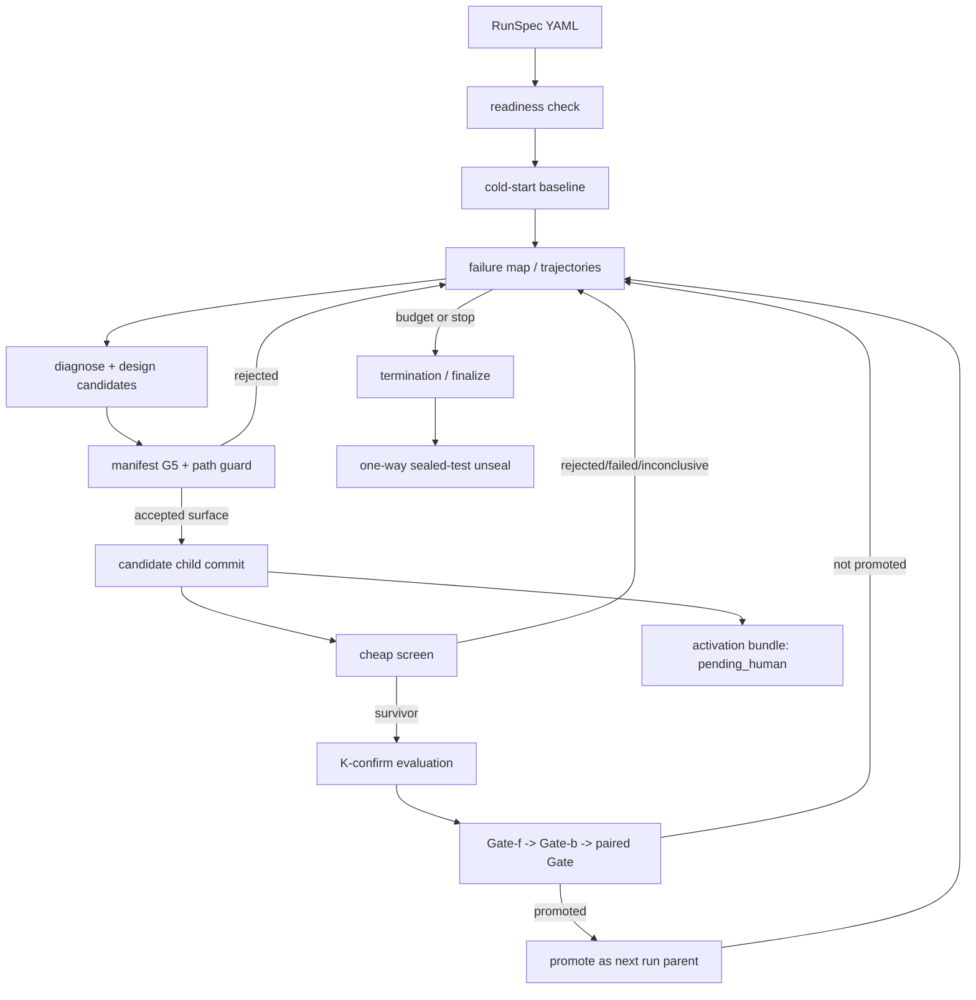

# Evolver architecture

Pico Evolver is an opt-in, benchmark-gated workflow around the Runtime. It
turns benchmark failures into candidate commits and evidence; it does not
silently rewrite the running Pico installation.

The public operator runbook is [pico/evolver/README.md](../../pico/evolver/README.md).
This document focuses on component boundaries, durable state, Gates,
activation, and limitations.

## Product contract

The public surface is:

```text
pico evolve check --config RUN.yaml
pico evolve run --config RUN.yaml [--smoke]
pico evolve status --config RUN.yaml
pico evolve finalize --config RUN.yaml --yes
```

Properties:

- opt-in only;
- budget-bounded;
- resumable from durable artifacts;
- benchmark-specific through a `BenchBundle`;
- train decisions isolated from sealed-test results;
- candidate code committed in the subject repository;
- promotion within the run is not production activation;
- accepted candidates begin `pending_human`;
- no model-weight training.

## Main components

| Area | Ownership |
| --- | --- |
| `pico/evolver/launch/` | Run-spec loading, readiness checks, command dispatch, run metadata, status/finalize |
| `pico/evolver/orchestrator/` | cold start, rounds, diagnosis, design, evaluation funnel, Gates, parent selection, sealed-test lifecycle |
| `pico/evolver/tree/` | candidate nodes, journals, Git commits/refs, parent graph |
| `pico/evolver/applier/` | candidate patch application, path guard, immutable kernel, activation beacon checks |
| `pico/evolver/analysis/` | paired significance, retention, stability and failure analysis |
| `pico/evolver/candidate_manifest.py` | Candidate Label, target files, digests, `PatchWhere`, G5 validation |
| `pico/evolver/candidate_evidence.py` | bind executable evaluation evidence to a candidate |
| `pico/evolver/activation/` | before/after/rollback artifacts, state transitions, digest-bound activation bundle |
| `benchmarks/appworld/evolve/` | checkout example `BenchBundle` |
| `benchmarks/evolver/small_real_subject/` | template copied into a disposable subject that owns its registered bundle and immutable grader |

`pico/eval_engine/` is separate source and is not automatically mounted into
the normal Runtime or Evolver path by Runtime Assembly.

## Inversion through BenchBundle

Core Evolver owns the method; a benchmark owns its environment:

```text
Core owns:
  rounds, budget, candidate graph, Gate order, sealing, journals, activation

BenchBundle owns:
  task splits, scorer subprocess, result parsing, infra markers,
  trajectory rendering, editable paths, subject preparation
```

The benchmark contract is defined in
[evolve-bench-contract.md](../specs/evolve-bench-contract.md). AppWorld is the
checkout example. PR #56 adds a tracked small-real subject template whose
disposable repository owns its registered plugin and immutable grader. Design
references to EvoAgentBench or another framework line remain future examples.

Normal Pico Runtime code never imports `benchmarks/`. An Evolution Run lazily
loads the selected benchmark plugin from a repository checkout because the
benchmark and subject code are part of that experiment.

## Run lifecycle



### Check

Readiness validates:

- run-spec schema and relative path resolution;
- subject repository and pinned base commit;
- clean/allowed Git state;
- benchmark registration and split files;
- model and endpoint configuration;
- scorer and environment readiness;
- editable-path whitelist and immutable kernel;
- a small Provider probe where required.

`check` does not prove a benchmark result. It proves that known prerequisites
are present and rejects placeholders early.

### Cold start

The cold-start baseline fixes the control data for the run. Trials are durable
and idempotent; a completed trial is not spent again after restart.

### Round

A round:

1. selects failure causes;
2. asks the driver/designer to propose bounded changes;
3. applies the patch only to the benchmark's mutable surface;
4. validates G5 before a candidate commit exists;
5. screens cheaply;
6. confirms survivors at the configured K;
7. runs evidence Gates;
8. chooses the next parent or terminates.

### Finalize and unseal

`finalize` explicitly ends a resumable run and unseals the test result. The
`unsealed_at` stamp is one-way: after held-out results become visible, the same
run cannot resume candidate decisions.

Natural termination follows the same final reporting path. Repeated
`status`/`finalize` reads rebuild the summary from durable sources and must be
byte-stable when no state changed.

## Durable artifact model

Typical `work_dir`:

```text
run_meta.json
journal/rounds.jsonl
nodes/*.json
findings.md
failure_map.json
trials/...
sealed/...
retention.json
evolution_summary.json
activation/<candidate_id>/
```

Important authorities:

- `run_meta.json`: config fingerprint, resolved subject/base identity, and
  one-way unseal state;
- round journal: resumable state-machine source;
- node ledgers: candidate ancestry, commits, scores, Gates, and terminal state;
- subject Git commits and `refs/evolver/*`: exact code versions;
- sealed storage: unavailable to decision code before unseal;
- `retention.json`: held-out result after finalization;
- activation bundle: review and rollback boundary.

A partial trailing JSONL record may be recoverable. Corruption in the middle
fails rather than guessing. Resuming under a changed configuration fingerprint
is refused.

## Candidate Manifest and G5

The Manifest binds:

- Candidate Label;
- `PatchWhere`;
- target paths;
- pre/post content digests;
- parent and candidate Git identity;
- mutable allowlist;
- immutable evaluation kernel.

G5 runs before a candidate commit is accepted into evaluation. It prevents a
broad design Sandbox from becoming a broad activation allowlist.

### Current label matrix

| Label | Current result |
| --- | --- |
| `runtime` | Supported only for an exact benchmark-owned mutable allowlist, including the AppWorld example and tracked small-real subject |
| `skill` | Schema-visible, fails G5 |
| `prompt` | Schema-visible, fails G5 |
| `policy` | Schema-visible, fails G5 |
| `model_profile` | Schema-visible, configuration-only by contract, fails G5 |
| `route` | Schema-visible, configuration-only by contract, fails G5 |

The other labels need their own deterministic fixtures and evaluators. Relabeling
a Runtime patch does not create that support.

## Evaluation funnel and verdicts

The funnel reduces cost:

1. cheap screen on a small task set and low K;
2. confirm survivors on the configured train set and K;
3. Gate pipeline;
4. held-out result only after termination.

Gate order:

- **Gate-f:** enough valid, comparable measurements; infrastructure loss is not
  a low score;
- **Gate-b:** executable attribution, including the required activation beacon
  for current Python candidates;
- **paired Gate:** sufficient paired lift/significance against the baseline.

Evidence result vocabulary:

- `accepted`;
- `rejected`;
- `failed`;
- `inconclusive`.

A reproducible rejection is a valid Evolution Run outcome. A missing Provider,
broken scorer, or infrastructure failure is not a no-improvement result.

Focused-Fisher/train evidence can support a candidate decision but is not the
sealed retention result. Candidate-selection code cannot read held-out results
before finalization.

## Promotion, activation, and rollback

These terms are separate:

| Term | Meaning |
| --- | --- |
| candidate | one proposed child change |
| promoted | selected as the next parent inside the Evolution Run |
| accepted evidence | candidate satisfied the implemented evidence contract |
| `pending_human` | activation artifacts exist and require review |
| `ready` | reviewer declared the artifact ready |
| `activated` | operator recorded activation |
| `rolled_back` | operator recorded rollback |

`create_activation_artifacts` writes:

- Manifest and candidate evidence;
- before and after snapshots;
- rollback snapshot;
- parent/candidate commit binding;
- artifact digests;
- activation state.

`set_activation_state` changes the artifact state. It does not move the live
checkout, cherry-pick a candidate, or deploy anything. The current public CLI
does not expose all activation transitions. Production application remains a
manual operator workflow.

## Isolation and threat model

Current safeguards:

- benchmark editable-path whitelist;
- immutable Evolver and scorer paths;
- Manifest target and digest validation;
- child Git commits and isolated refs;
- sealed result directory outside decision reads;
- activation beacon attribution;
- deterministic artifact digests;
- manual review before activation.

They defend against accidental or model-generated shortcuts in a cooperative
local workflow. They do not defend against determined malicious candidate code:

- candidate code executes with the scorer's process privileges;
- the benchmark oracle may be reachable;
- designer execution is not a full filesystem/network jail;
- credentials visible to the evaluation process are in scope;
- digests are not signatures or remote attestations.

Run Evolver in a disposable container or VM with scoped credentials. Diff-audit
every promoted commit before citing a score or applying a change.

## Current evidence and limitations

Deterministic V-E0 verifies:

- public CLI surface and readiness;
- journaling, interruption, resume, status, and finalize;
- four-way evidence results;
- G5 and immutable surfaces;
- Gate arithmetic and infra rerun behavior;
- candidate commits and activation beacon;
- activation/rollback artifacts;
- byte-stable summaries;
- fixture-backed cross-process lifecycle;
- small-real subject setup, immutable grading, source validation, interruption,
  resume, finalize, and release-layer wiring.

It does not prove:

- a full-size production Evolution Run;
- current real Provider availability;
- real held-out retention on a release commit;
- safe operation against malicious candidate code;
- any unsupported Candidate Label;
- automatic improvement;
- production activation.

Issue #24 requires a real model to complete the tracked small-real run before
the v1 release candidate. Accepted, rejected, or reproducible no-improvement is
valid when evidence is complete; Provider or infrastructure failure is not.

Scaling deferrals include zero-hit preflight defaults, borrowing, and affinity
data. They should be implemented only after measured benchmark cost shows the
need.

## Verification

Use:

```bash
make verify-evolver
```

Representative tests:

- `tests/test_evolver_candidate_manifest.py`;
- `tests/test_evolver_candidate_evidence.py`;
- `tests/test_evolver_activation_artifacts.py`;
- `tests/test_evolver_gates.py`;
- `tests/integration/test_evolver_lifecycle_e2e.py`.

V-E0 is deterministic and fixture-backed. A real Evolution Run needs separate,
redacted, commit-bound evidence.
