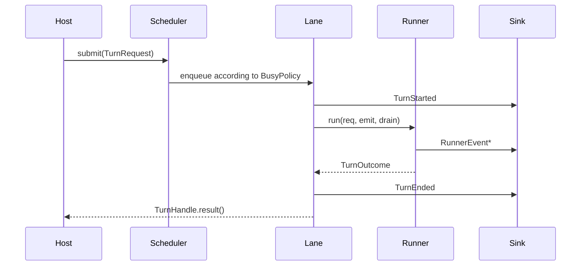

# Runtime and Turn flow

This document follows one Turn from each host into Spine, through Context,
Provider and Tools, and back to delivery. Canonical term definitions live in
[CONTEXT.md](../../CONTEXT.md).

## Core data model

### Input

`pico/spine/turn.py::TurnRequest` is the single execution request. It carries:

- `origin`: `USER`, `CRON`, or `SUBAGENT`;
- `source`: Channel/routing address;
- text and media;
- a conversation identity;
- the requested busy policy.

`BusyPolicy` is:

- `APPEND`: queue after current work;
- `INJECT`: offer the message to the running Turn at a Tool-loop gap, then
  append it as a new Turn if it was not drained;
- `INTERRUPT`: cancel the running user Turn and place the new request first.

System-origin requests do not preempt user work through an implicit shortcut;
the Scheduler normalizes their policy to the safe supported path.

### Output

The runner may emit only `RunnerEvent` values:

- `Text`;
- `MediaOut`;
- `StreamDelta`;
- `Reasoning`;
- `Notice`;
- `ToolEvent`.

The Spine worker owns `TurnStarted`, `TurnEnded`, and `TurnFailed`. An
enforcement guard rejects a runner that tries to emit lifecycle events.

`pico/spine/runner.py::TurnOutcome` carries usage, explicit-reply state, Tool
call/failure counts, Memory hits, injected Skill ids, Context path/fallback
reason, and Skill-source failures. Hosts inspect this typed result instead of
parsing terminal text.

## Host entry paths

### One-shot CLI and REPL

```text
pico run [-m text]
  -> cli/agent_commands.py
  -> assemble_runtime()
  -> build_repl()
  -> TurnRequest(origin=USER)
  -> Scheduler
  -> AgentTurnRunner(stream=False)
  -> CliOutlet
```

One-shot mode submits one request. Interactive REPL mode repeatedly reads user
input. For each Turn it waits for both:

1. `TurnHandle.result()`, meaning the runner emitted no more events;
2. `DeliveryHub.wait_idle()`, meaning the CLI outlet rendered its queue.

The REPL therefore has an explicit render barrier. It is non-streaming:
final text arrives as one `Text` event. Progress, reasoning, and failed Tool
events are rendered only when the relevant host flags and callbacks are set.

Session selection supports new, explicit, continued, and resumed Sessions.
Host code owns Runtime start/close and any terminal cleanup.

### Native TUI

```text
bare pico
  -> cli/tui_commands.py
  -> Python loopback JSON-RPC server
  -> Node 22 React/Ink bundle
  -> turn.send
  -> tui_rpc/spine.py
  -> Scheduler
  -> TuiTurnRunner(stream=True)
  -> TuiOutlet
  -> subscribed turn events
```

The Python process owns Runtime state. The Node process owns rendering and
client-side interaction state. They communicate over authenticated loopback
JSON-RPC; the TUI never imports Python internals.

The TUI streams text, reasoning, Tool state, terminal status, and usage. A
client-generated Submission ID binds events to the exact accepted request.
If the Session Lane already owns work, `turn.send` reports
`turn_in_progress` instead of acknowledging a user request that may wait behind
unrelated system work.

Session switching and mutation are serialized in the frontend. Confirm and
Clarify overlays complete paused Runtime RPC round-trips.

Production constraints:

- the wheel must contain exactly one built TUI bundle;
- Node.js 22 must exist on the host;
- a five-second Runtime handshake must succeed.

### Gateway and Channels

```text
Feishu / QQ / WeCom event
  -> Channel adapter
  -> ChannelManager
  -> Intake
  -> TurnRequest(origin=USER)
  -> Gateway Scheduler
  -> GatewayTurnRunner(stream=False)
  -> DeliveryHub
  -> ChannelOutletAdapter
  -> platform send API
```

Gateway startup order:

1. load Config and acquire the single-instance lock;
2. initialize file logging;
3. construct Cron service and optional model Router;
4. discover and validate configured Channels;
5. assemble Runtime and start the selected Memory backend;
6. build Gateway Spine and delivery outlets;
7. bind Cron, Subagent reinjection, Question Broker, and Intake;
8. start Channels and loopback health service.

`ChannelManager` discovers cheap adapter specs and imports a platform SDK only
when that Channel is enabled. Missing SDK or startup failure disables and
reports that adapter without stopping unrelated adapters. An invalid selected
Memory backend is different: Runtime startup fails closed.

`Intake` normalizes inbound data and submits it on the Scheduler's event loop.
A user message arriving during the same conversation's active Turn requests
`INJECT`. `/stop` cancels the Lane and its Subagents.

Channels receive final `Text` and `MediaOut`. They do not receive token-stream,
reasoning, or Tool events as platform message edits. Each Channel has an
independent bounded delivery queue so one slow platform does not block others.
Delivery retries retryable failures with exponential delays. An Outlet reports
a platform rejection that retrying cannot repair as terminal, so it is dropped
after its first attempt. Both paths emit a
`channel.deliver` span and may publish a `DELIVERY_FAILED` notice through an
injected sink. Hosts do not currently wire that notice sink. The Agent Turn may
already be complete, so delivery failure is not a transactional Turn failure.

### Cron

```text
persist job
  -> compute next fire in IANA timezone
  -> claim due fire
  -> TurnRequest(origin=CRON)
  -> Gateway Scheduler system pool
  -> Agent Loop
  -> record outcome
  -> deliver to configured Channel targets
```

Cron is user-scheduled execution, not proactive Agent behavior. Job state,
claim state, terminal diagnostics, and one-shot completion survive restart.
The production Feishu exactly-once tracer bullet remains open in Issue #21.

### Subagents

The main Agent uses the `spawn` Tool to start work through
`SubagentManager`. Subagent execution has its own concurrency and per-Session
hourly spawn limits. Its final result returns as a new
`TurnRequest(origin=SUBAGENT)` through Spine, so result delivery uses the same
ordering and lifecycle model as other Runtime work.

## Spine scheduling

### Lane

One conversation maps to one `Lane`. A Lane:

- executes at most one Turn at a time;
- owns pending APPEND work and the INJECT mailbox;
- is the cancellation domain;
- resolves every `TurnHandle` exactly once;
- warns when pending depth reaches 50;
- becomes reclaimable after 300 seconds idle.

The queue has no hard capacity. A stalled conversation does not block other
Lanes, but sustained submission can grow that Lane's memory use.

### Origin pools

`OriginPools` uses independent semaphores:

- user pool for `Origin.USER`;
- system pool for `Origin.CRON` and `Origin.SUBAGENT`.

The pools do not borrow. A burst of scheduled work cannot consume every
user-facing Agent slot.

### Lifecycle and cancellation



On cancellation after start, the worker emits `TurnFailed(cancelled=True)`.
On an exception, it emits `TurnFailed` and resolves the handle with no normal
outcome. A cancellation before start has no unmatched `TurnStarted`.

Cancelling the coroutine waiting on `TurnHandle.result()` does not cancel the
Turn because the Future is shielded. The caller must use the handle or
conversation cancellation path.

Shutdown:

1. seals the Scheduler against new submissions;
2. resolves queued and mailboxed work as cancelled;
3. allows running work a bounded grace interval;
4. cancels survivors and awaits cleanup;
5. closes delivery workers.

## Agent Loop

`pico/agent/loop/main.py::AgentLoop.run_turn` owns one complete reaction.

### Initialization

Agent Loop receives:

- Provider and default model;
- Workspace and Session Manager;
- Context, Memory, SkillForge, and Runtime configuration;
- optional Memory backend and model Router;
- built-in and plugin Tools;
- MCP definitions;
- Sandbox and execution policy;
- Cron service and Channel configuration;
- Subagent and recovery limits;
- interactive policy for Checkpoint behavior.

Default Tools include file read/write/edit/list, grep/find, shell execution,
Web search/fetch, message, ask-user, spawn, optional Cron, plugin Tools, and MCP
Tools after connection. Deep Research, media generation, and Remote Skill Hub
Tools are absent.

### Turn flow

```mermaid
sequenceDiagram
    participant Runner
    participant Loop as Agent Loop
    participant Session
    participant Context
    participant Provider
    participant Tools
    participant Memory as Memory Backend

    Runner->>Loop: run_turn
    Loop->>Tools: ensure Sandbox and MCP ready
    Loop->>Session: load or create
    Loop->>Context: assemble full window
    Context-->>Loop: system + selected history + user
    loop Iterations
        Loop->>Provider: chat or stream
        Provider-->>Loop: text, reasoning, Tool calls, Usage
        Loop->>Tools: validate and execute Tool calls
        Tools-->>Loop: ToolResult
    end
    Loop->>Session: save transcript
    Loop->>Context: after_turn
    Loop->>Memory: store normalized Turn slice
    Loop-->>Runner: TurnOutcome
```

At each Iteration, the model may produce content, reasoning, or Tool calls.
Tools are executed and their results are appended for another model call.
When `max_iterations` is reached, a tools-disabled Synthesis call returns the
best partial result and the Turn ends as interrupted.

### Recovery

- Context overflow may trigger at most two emergency shrinking attempts.
- Empty response behavior is bounded by configured prefill, nudge, or retry
  limits.
- Repeated deterministic failure of the same Tool triggers a bounded
  loop-breaking nudge; transient rate limits and legitimate empty searches do
  not count as hard repetition.
- Per-turn Checkpoint may commit Workspace state to
  `<workspace-state>/shadow.git`. It never touches the user's `.git`.
  Checkpoint failure disables that safety net rather than claiming durability.

### Failure boundaries

| Failure | Runtime behavior |
| --- | --- |
| Tool schema, timeout, or Tool exception | Failed `ToolResult` returned to model; Tool event records failure |
| Provider terminal error | Raised as a failed Turn |
| Context assembly or required Memory recall error | Failed Turn |
| Session persistence error | Failed Turn |
| Memory store error after Session save | Failed Turn with possible durable Session partial success |
| Skill source failure | Isolated per source; other sources may still select Skills; diagnostics record it |
| query rewrite or Skill LLM-gate failure | Deterministic fallback selection path |
| tracing failure | Swallowed by tracing facade; application flow unchanged |
| Channel send exhaustion | Logged and dropped after retry; current Agent Turn is not rolled back |

This table explains why a Turn, a platform delivery, a persisted transcript,
and a long-term Memory update cannot be represented by one Boolean.

## Delivery model

`DeliveryHub` routes by the event's `source.channel`.

- one queue and resident worker per outlet;
- queue capacity 100;
- FIFO within one outlet;
- separate backpressure across Channels;
- streaming only for outlets declaring the capability;
- final rendering barrier available through `wait_idle`;
- no persisted outbound queue;
- abrupt close cancels in-flight retry work.

The Gateway sink also:

- sends a generic user-visible reply for non-cancelled terminal failure;
- invokes Turn-complete hooks;
- logs nonzero Tool failure counts;
- captures text only for origins, such as Cron, that require explicit
  readback before multi-target delivery.

## Tests and Gates

| Boundary | Representative verification |
| --- | --- |
| Scheduler, Lane, origin pools, cancellation, shutdown | `tests/test_spine_scheduler*.py` |
| Delivery queues, streaming, retry, render barrier | `tests/test_spine_delivery.py`; host Spine tests |
| CLI composition and REPL | `tests/test_cli_runtime_assembly.py`; `tests/test_cli_repl_spine.py` |
| TUI-RPC Turn behavior | `tests/test_tui_rpc_spine.py`; `tests/test_tui_rpc_tool_events.py`; TUI test suite |
| Gateway and Channel intake/outlet | `tests/test_cli_gateway_spine.py`; `tests/test_channels_intake.py`; adapter tests |
| Agent recovery and overflow | `tests/test_agent_loop_context_overflow.py`; `tests/test_agent_loop_tool_loop_break.py` |
| Installed host parity | `make verify-runtime-hosts` with a V-P0 wheel |
| Live Provider host path | `make verify-live-provider` with required credentials |
| Long-term Memory continuity | `make verify-myna-integration` with pinned Pico and Myna wheels; proves the installed public contract only |

See [Developer guide](../dev.md) for exact prerequisites and evidence
classification.
