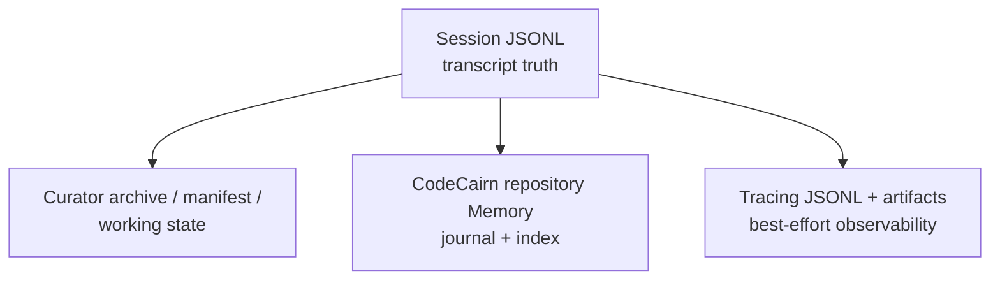

# State, Context, Memory, and Skills

Pico separates conversational truth, context selection, semantic Memory, Skill
retrieval, and observability. This document explains those state domains and
their failure boundaries.

## State roots

| State | Default | Override or owner |
| --- | --- | --- |
| Pico home | `~/.pico` | `PICO_HOME` |
| Foreground Workspace | Current directory | CLI `--workspace` or Config |
| Foreground Workspace State | `~/.pico/projects/<project-id>` | Runtime |
| Gateway / configured Workspace | `~/.pico/workspace` | CLI `--workspace` or Config |
| Session files | `<workspace-state>/sessions/` | `SessionManager` |
| Curator state | `<workspace-state>/memory/.curator/` | Context Engine |
| local Workspace Skills | `<workspace-state>/skills/` | Local Skill catalog |
| user Plugins | `~/.pico/plugins/` | Plugin discovery |
| project Plugins | `<process-cwd>/.pico/plugins/` | Plugin discovery; note this uses current working directory, not configured Workspace |
| CodeCairn repository Memory | CodeCairn-owned runtime root | Initialized with `codecairn init` |
| Tracing | `~/.pico/traces/` | `PICO_TRACING_DIR` |
| Evolution Run | run-spec `work_dir` | Evolver |

Pico does not automatically import external product state. An explicit
`--workspace` or non-default configured Workspace is direct operation with
colocated state on that path, not a migration protocol.

## Session: transcript authority

`pico/session/manager.py::SessionManager` stores a Session at:

```text
<workspace-state>/sessions/<channel>/<chat_id>.jsonl
```

The composite key is `<channel>:<chat_id>`. The user-facing Session id is the
bare `chat_id`; resolution accepts a full key, one exact bare id, or one
unambiguous prefix.

### Persistence model

The JSONL file contains:

- metadata records with identity, timestamps, mutable metadata,
  `last_consolidated`, and pending clarification;
- append-only message records.

Normal saves append new messages plus the latest metadata. Operations that
shrink or rewrite state, such as undo or clear, use atomic replacement.

Concurrency and corruption protections:

- file locks serialize readers and writers;
- epoch/content fences reject a stale writer;
- a partial final JSONL record can be ignored and repaired;
- malformed data in the middle is `StorageCorruptionError`;
- metadata identity must match the requested key and path;
- no caller silently switches to a different Session on ambiguity.

### Lifecycle

Supported operations include:

- create/get and resume;
- list and resolve;
- fork with lineage metadata;
- undo and retry-oriented mutations;
- portable export;
- delete.

The Portable Session Export schema `pico.session.export.v1` contains a
canonical payload, Markdown view, and SHA-256 digest. Verification does not
depend on the source Session file remaining present.

Deleting a Session does not imply deletion of Curator archives, CodeCairn
Memory, or traces. Those domains have separate ownership.

## Unified Context Engine

`pico/context_engine/factory.py::build_context_engine` always builds one
`ContextAssembler`. `ContextConfig.engine` is accepted only for compatibility
and does not select among implementations.

### Prompt segments

The assembler owns six ordered segments:

| Order | Owner | Content |
| --- | --- | --- |
| 1 | `IdentitySegmentBuilder` | `# Pico` identity |
| 2 | `BootstrapSegmentBuilder` | Workspace bootstrap files |
| 3 | `MemorySegmentBuilder` | host `user.md` and selected backend recall |
| 4 | `ActiveSkillsSegmentBuilder` | always-active local Skills |
| 5 | `SkillsSegmentBuilder` | selected local Skill candidates |
| 6 | `CuratorSegmentBuilder` | selected history and Curator Working State |

The current user message is a structural item, not a Segment. Tool definitions
are a side channel passed to the Provider and included in token budgeting; they
are not rendered as prompt prose.

### Two-phase assembly

```text
Phase A, parallel:
  identity + bootstrap + memory + active skills + selected skills
    -> fixed system prefix

Phase B, prefix-aware:
  fixed prefix + user + Tool schemas + full Session history
    -> Curator budget and selection
    -> final system + history + user
```

Phase A uses normal `asyncio.gather`. A required Memory recall error therefore
fails assembly; it is not converted to an empty segment.

### Curator

The Curator is an internal bounded Agent that selects the next context window.
It never answers the user.

- **Fast Path:** history is below pressure threshold; pass it through without a
  Curator LLM call.
- **Slow Path:** inspect the Manifest, archive/retrieve messages, and submit a
  structured `ContextPlan`.
- **Fail-Safe:** on timeout, Provider error, or invalid plan, use deterministic
  protected, relevant, and recent selection.

The Slow Path is bounded by its configured time and step limits. The resulting
path and fallback reason enter Turn metadata so a fallback is not disguised as
LLM-curated success.

Curator state:

- Manifest: per-message token, snippet, relevance, protection, and archive
  metadata;
- Archive: verbatim evicted messages with references;
- Working State: goals, decisions, and open threads injected into the prompt;
- traces: Context-specific diagnostic state.

Archive does not delete the original Session transcript. It is a lossless
selection aid. Legacy consolidation is a lossy summary path and is not the
primary history owner when `ContextAssembler.owns_compaction` is true.

## Memory backend contract

`pico/memory_engine/backend.py::MemoryBackend` defines:

```python
recall(query, *, user_id=None, agent_id=None, top_k)
store(session_id, messages)
feedback(signals)
start()
stop()
```

The public compatibility Interface accepts exactly one track id:

- `user_id`: Memory recall for segment 3;
- `agent_id`: reserved for third-party backends that still implement an Agent
  track.

The current host calls only the user lane. CodeCairn interprets it as
repository-scoped recall; the `user_id` does not choose a repository or
namespace. The Workspace selected by Runtime Assembly determines the
initialized CodeCairn repository. Local Skills do not use the Memory backend,
and the active host does not dispatch Memory feedback.

The broader `agent_id` and `feedback` methods remain in the public Protocol so
existing third-party Memory Plugins do not break during this replacement.

### Enable, disable, and failure

- `memory.backend = "codecairn"` selects the installed CodeCairn contribution
  by default.
- `memory.backend = null` explicitly disables Memory recall, persistence,
  personalization Memory, and Curator Memory Tools.
- Local Skills and Sessions continue with Memory disabled.
- a configured backend that is missing, cannot construct, cannot start, or
  fails recall/store propagates failure.
- plugin-contributed Tool construction is more lenient: one bad optional Tool
  is logged and skipped.

The difference is intentional. A selected persistence backend must not
silently lose Memory, while an optional Plugin Tool must not prevent the Agent
from booting. The removed `memory.backend = "everos"` value is not rewritten;
startup fails with instructions to initialize CodeCairn and select
`codecairn`, or explicitly select `null`. Pico neither reads nor deletes the
operator's old EverOS data.

## Plugin Registry

Discovery sources and conflict priority:

| Priority | Source | Location |
| ---: | --- | --- |
| 4 | bundled | `pico/plugin/memory/<plugin-id>/` |
| 3 | user | `~/.pico/plugins/<plugin-id>/` |
| 2 | project | `<process-cwd>/.pico/plugins/<plugin-id>/` |
| 1 | entry point | Python entry-point group `pico.plugins` |

Directory discovery parses `pico-plugin.toml` without importing backend code.
Entry-point package resource discovery may import the package, so third-party
plugin `__init__.py` files must remain cheap and safe.

Activated Plugins may contribute:

- Memory backend factories;
- Tool factories.

Duplicate contribution names fail. Bundled Plugins cannot be silently
shadowed by lower-priority copies. `plugins.disabled` is an explicit denylist.
There is currently no remote discovery or installation surface.

## Installed CodeCairn adapter

Pico depends on an immutable CodeCairn Git commit. The installed distribution
publishes entry point `codecairn` in group `pico.plugins`, manifest id
`codecairn-memory`, and backend contribution `codecairn`. Pico source imports
only the public `MemoryBackend` carrier and never CodeCairn private modules.

The operator initializes the target Git repository explicitly:

```bash
codecairn init
```

At startup the adapter resolves the Pico Workspace, validates the repository
binding and retrieval profile, and fails closed if initialization,
configuration, provider, journal, or index requirements are invalid. It does
not consult process cwd for repository identity. Pico exposes no CodeCairn
runtime-root, repository, profile, or credential override.

The Adapter returns one compiled, source-attributed Recall Context for the user
lane. After a Turn, Pico passes the same normalized message slice that Session
persistence accepted to `store()`. CodeCairn owns its Source Journal, import,
index, ranking, packing, durability, and repository identity. Synchronous
operations run off the host event loop.

The removed EverOS adapter, direct dependency, remembered-Skill source,
feedback routing, and `understand_media` Tool are not compatibility fallbacks.
Historical EverOS evidence remains valid only for the commits and experiments
that produced it.

## Local Skills and SkillForge

### Local catalog

`LocalSkillCatalog` discovers:

1. Workspace `skills/`;
2. configured local directories;
3. package reference Skills under `pico/memory_engine/skills/`.

Precedence is Workspace, configured directories, then package reference. Skill
frontmatter and required binaries/environment determine availability.

The source tree contains a weather reference Skill. The current wheel build
allowlist does not guarantee that directory is installed, so release
documentation must not claim it as an installed-wheel capability until V-P0
protects its manifest.

Local retrieval uses a self-contained BM25/CJK-aware index. It does not require
an embedding service or Remote Skill Hub. Workspace watching is best effort;
failure falls back to explicit invalidation/rescan behavior.

### SkillForge Router

The active router is constructed from the Local source only. Its BM25/CJK-aware
retrieval, availability filtering, and bounded selection are independent of
the Memory backend. Generic reciprocal-rank fusion helpers remain for
historical benchmark reconstruction and third-party callers, but the current
Runtime does not fuse repository Memory into Skills.

Selection can include:

1. optional LLM query rewrite;
2. Local retrieval;
3. bounded ranking;
4. optional LLM gate;
5. Skill body or summary injection.

Failure boundaries:

- one source failure becomes an empty source and a diagnostic;
- query-rewrite failure falls back to the original query;
- LLM-gate failure falls back to bounded ranking;
- Memory backend hard failure outside the isolated Skill-source path remains a
  failed Turn.

### Current SkillForge limitations

The Config still contains future-facing fields for statistics, automatic
detection/evolution, success triggers, draft activation, and idle retirement.
Those lifecycle controls are not wired as a complete feedback-driven system.
Do not describe them as active self-evolution.

Remote Mass/Hub retrieval and marketplace installation were removed. A legacy
`mass_library_db` field may be accepted for config compatibility but is ignored
with a warning.

## Persistence and consistency boundaries



Arrows show data flow, not a transaction:

- Session save can succeed before CodeCairn store fails;
- Curator archive can exist independently of a later Session mutation;
- tracing may be absent because it is non-interfering;
- Session deletion does not promise semantic-Memory erasure;
- Evolver artifacts are yet another independent domain.

Any future deletion, privacy, or transactional guarantee must define behavior
for every domain explicitly.

## Verification

| Concern | Verification |
| --- | --- |
| Session atomicity, corruption, resolution, fork, export | retained Session tests |
| Context segment order, budget, fast/slow/fail-safe | retained Context and Curator tests |
| Memory disabled isolation | Agent Loop and Runtime Assembly contract tests |
| CodeCairn adapter discovery and failure propagation | installed Plugin and backend contract tests |
| normalized post-Turn storage | Session-normalization and Agent Loop pipeline tests |
| repository-scoped store and recall | installed CodeCairn deterministic integration smoke |
| Local Skill routing with Memory on/off | SkillForge and Skill-router tests |
| Plugin discovery and contribution conflicts | Plugin registry tests |

These deterministic checks prove package identity, lifecycle, store/recall
plumbing, and Local Skill independence. The separate paired campaign is now
complete and measurement-valid, but its positive claim remains ineligible
because the treatment returned three memories for every hard-negative query.
