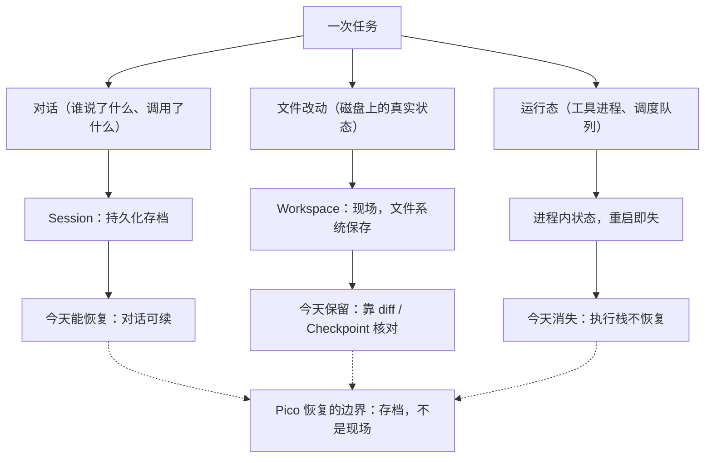
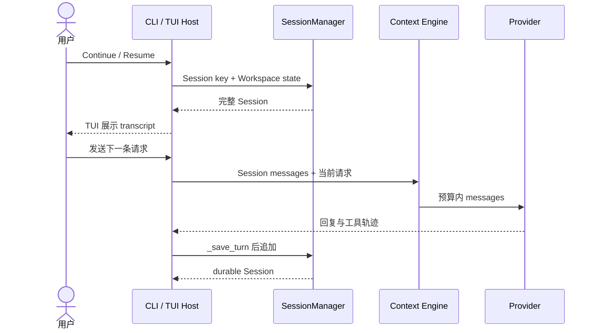
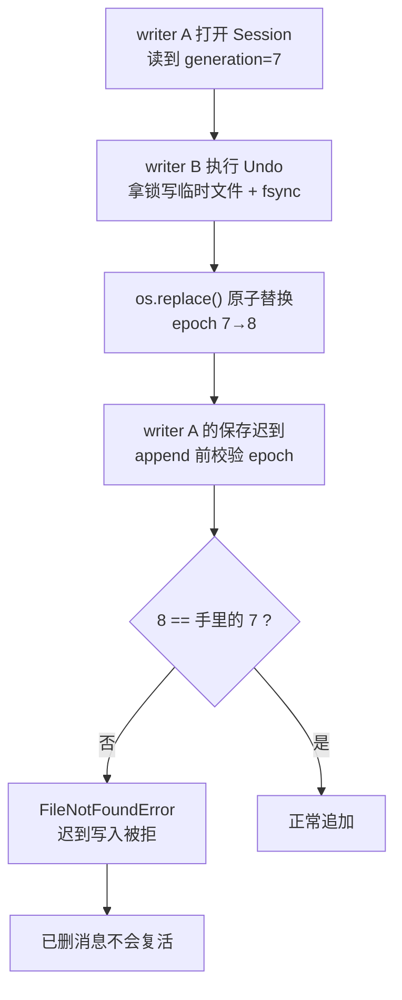
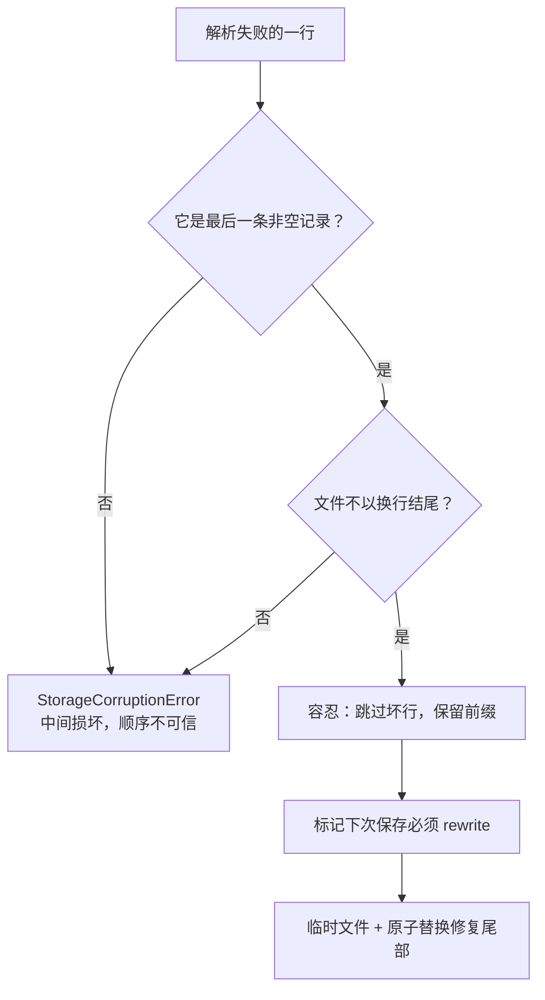
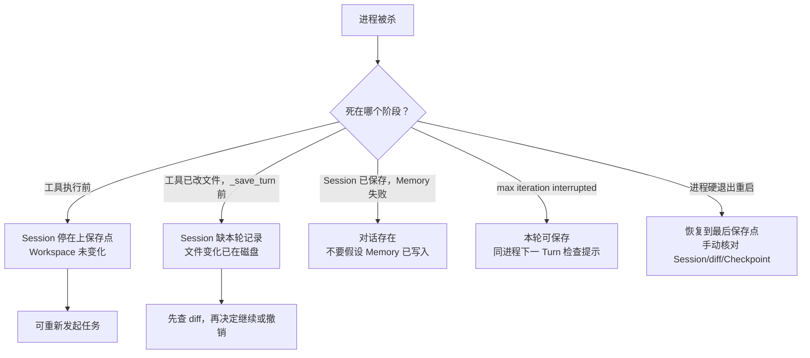

# P05｜Session 与恢复

<callout emoji="💡">
**Session 是 Agent 对话连续性的基础设施。**它保存已经发生的对话——谁说了什么、调用了哪些工具、结果是什么——并让“昨天的任务今天接着做”成为可能。各家harness都有自己的/resume命令，可能名字不同，但思想都是一致的，让用户有连续性对话的体验。
</callout>

昨天你让 Pico 修一个失败测试。它读文件、改代码、跑测试，改了两个文件之后，你把终端关了。今天重新打开 Pico，执行 `pico run --continue`，昨天的对话回来了。

但先别急着继续干活。请想清楚一个容易混的问题：**到底哪些东西回来了，哪些没有？**对话回来了；被模型看到的历史按预算选择回来了；但工具改过的文件不会回滚，正在执行的工具调用不会续跑，Scheduler 队列里的 Turn 不会重新排队，连"上次被打断、下一步该检查什么"这条提示，也只活在同一个进程的下一轮里。

把 Session 理解成一份**存档**，Workspace 是**现场**。存档记录对话的完整事实——谁说了什么、模型调用了哪些工具、结果是什么。现场是磁盘上的真实文件。Pico 恢复的是存档，不是现场。这个区分决定了后面所有代码的位置。




# 一、现场勘查：先分清哪些回来了，哪些没有

“恢复”这个词容易把不同层级混在一起。Pico 当前对每类状态给出的保证如下：

| 状态 | 恢复情况 | 实际行为 |
|-|-|-|
| 已经持久化的会话消息 | 会恢复 | 从当前 Workspace 对应的 Session JSONL 读取并重建 |
| TUI 中展示的 transcript | 会恢复 | TUI Resume RPC 返回原 Session 的完整 raw messages |
| 模型本轮实际收到的历史 | 按预算选择 | ContextAssembler 把完整 Session 交给 Curator 等 Builder，最终 history 可能是完整历史，也可能是被选择后的窗口 |
| Workspace 当前文件 | 磁盘保留 | 文件由文件系统保存；Session Resume 不会替文件做回滚 |
| Workspace 的 shadow-git 快照 | 有条件产生 | Checkpoint policy 开启、Agent Loop 抵达收尾且存在文件变化时才可能提交 |
| 正在执行的工具调用 | 不会恢复 | 没有持久化 Python 调用栈、局部变量或工具进程 |
| Scheduler 队列与运行中的 Turn | 不会恢复 | 当前调度状态在进程内；重启不会续跑原队列 |
| 中断后的 recovery hint | 仅同进程下一 Turn | 只有 `interrupted` 结果会暂存在 AgentLoop 内存中；进程重启后不会自动重建这条提示 |

这张表读完后，一句话总结：**Pico 重新找到一段已经保存的对话，让下一条请求沿用它；文件、Memory、Checkpoint 和运行中的任务仍由各自的组件负责。**

# 二、最朴素的恢复：只把对话存下来，然后看它怎么坏

最朴素的 Session 实现是：每轮对话追加进一个 JSON 文件，恢复时读出来原样交给模型。做法简单直观，但会带来五个问题。

## 1. 只存对话，恢复不了现场

工具已经改了两个文件，进程在 `_save_turn()` 前退出。此时文件变化已在磁盘，Session 却只到上一条已保存消息。恢复时如果只看聊天记录判断工具是否执行过，你会得出错误的结论——对话里没有这次改动，但文件确实变了。现场勘查的第一课：**Session 保存的是对话连续性，不是工具副作用。**

## 2. 把“恢复”当成执行栈恢复

“resume”这个词在不同的产品里含义完全不同。有的产品恢复的是对话，有的恢复的是工作流步骤，有的恢复的是整个执行历史——把它们当成同一种实现去对比，或者把自己的 resume 说成能恢复执行栈，都会翻车。这个差异后面有一整节展开。

## 3. 损坏判定一刀切

进程可能在最后一行 JSON 写到一半时退出。尾部半条记录符合“写到一半”的故障形状，可以容忍并保留已确认前缀；但中间一条坏记录意味着后续顺序已经无法可信解释。两者必须区分：一个能修，一个必须停下来。一刀切地“要么全丢要么全留”都会丢东西。

## 4. 并发写入互相覆盖

同一个 Session 的两个正常 writer 会各自追加完整消息块，不会互相覆盖——但前提是有东西阻止旧 writer 在文件被重写后继续写。想象两人写同一张纸：A 撕掉重写，B 却还拿着旧纸往上面补字，删掉的话就被复活了。Pico 需要一种办法让 B 的“旧纸”失效。

## 5. 换了目录，会话“消失”

Session 不在全局目录里无条件混在一起。前台运行时，Session 文件位于 `<state>/sessions/<safe-channel>/<safe-chat-id>.jsonl`，而 state 由 Workspace 决定。换了工作目录再执行 `pico sessions list`，原会话可能看起来“消失”——文件通常没丢，新 Workspace 只是解析到了另一套 state。排查时先核对 cwd、`--workspace` 和配置，而不是立刻重建 Session。

# 三、先补齐前置，再看别人怎么处理

如果你没读过 P04，先花一分钟记下这几个概念——本章会用到它们的后果，不重新教机制：

| P04 概念 | 本章只需要知道 |
|-|-|
| 六个 Segment | 前五个固定材料每轮必进；第六个 Curator 决定过去哪些进本轮 |
| Curator 三路径 | 历史短走 Fast 直通；超预算走 Slow 内部模型提计划；内部失败走确定性 Fallback |
| HistoryTrimmer | 做工具配对闭合 + 7 键白名单投影 + 完整 Prompt 预算校验 |
| 预算 | 窗口减掉输出/工具/系统预留，余量才是历史额度 |
| Session ≠ Context | Session 是完整存档；模型只看见选入 Context 的部分 |

放下终端，先看别人怎么处理同一个问题。下面的梳理基于公开资料（见文末参考），目的不是照抄，而是建立参照线：**每个产品在“恢复什么”上做了不同的取舍。**

## Pi：会话是树，分支在原地发生

Pi（`~/.pi/agent/sessions/`）的 Session 文件是 JSONL，每条 entry 带 `id` 和 `parentId`，天然是一棵树。它的分支不创建新文件：`/tree` 让你跳到树里任意一个点，从那里继续，active leaf 移动，所有分支留在同一个文件里。`/fork` 和 `/clone` 才是摘出新文件——一个从历史 user 消息分叉，一个复制当前活跃分支。当 `/tree` 切走一条分支时，Pi 还可以生成 branch summary，把被放弃路径的上下文压缩成一段摘要挂在新位置，不重放整条分支。

Pico 的 fork 目前只走“深拷贝新 child”这一条路。Pi 的 `/tree` 是另一种取舍：分支的代价可以调节到零（原地树），代价是每个文件里同时住着多条互相竞争的路线。

## OpenAI Agents SDK：会话与模型上下文分层

OpenAI Agents SDK 把持久化历史、模型输入合并和 Provider 管理的 conversation 分成不同层：客户端保存 session 历史，下一轮把历史合并进模型输入，对话的最终形态由 Provider 会话管理。三件事不在同一个抽象里。

Pico 同样是分层，但把“选历史”的职责收进了自家的 Context Engine——Session 保存完整记录，ContextAssembler 决定本轮模型看到哪些历史，Provider 只收到最终请求。

## LangGraph：恢复的是图状态

LangGraph 的持久化单位是 thread checkpoint，保存的是 graph state——不只是消息，还有 next nodes、tasks、工作流步骤的中间状态。恢复一个 LangGraph thread，等于把工作流停在哪一步、下一步该执行哪个节点都找回来。

Pico 的 Agent Loop 是自由循环，没有可恢复的“节点图”，所以只持久化对话是自洽的。恢复粒度由状态模型的复杂度决定——哪天 Pico 引入结构化工作流，恢复粒度就得跟着变。

## Temporal：重放，而不是恢复

Temporal 是 durable workflow execution：目标是进程死亡后重放事件并继续工作流。它的恢复单位是整个 workflow 的执行历史，靠事件溯源重建状态，和“把聊天记录找回来”完全不是同一等级。

知道自己在谱系的哪一段很重要：Pico 做的是对话连续性恢复，不是 durable execution。把 resume 吹成“断点续跑”，等于承诺了执行栈恢复。

# 四、追查链路：从选 key 到写回

回到故事：你手里有“对话回来了”和“文件被改了”两个证据，但缺这两件事的先后顺序——**恢复链路先做了什么，保存边界在哪里？**把“第二天继续”展开，链路是这样走的：入口先选 key → Workspace 决定 state → SessionManager 重建 Session → 展示层和模型上下文分叉 → 新的 Turn 完成后写回原文件。



## 第一步：Host 先确定要继续哪段会话

Session key 的常见形状是 `channel:chat_id`：

```text
cli:20260811_103015_a1b2c3
tui:20260811_104210_d4e5f6
```

CLI 默认每次创建新会话，避免两个无关的一次性任务互相污染。只有用户显式选择 Continue、Resume 或完整 key 时，后续 Turn 才沿用旧 Session。三个入口互斥，`--session`、`--continue`、`--resume` 同时传会直接报参数错误。注意一个确定性约束：`--resume` 支持完整 id、裸 id 或唯一前缀，前缀同时命中多个会话时必须报 ambiguous，不能猜一个继续。

## 第二步：Workspace 决定 Session 去哪里找

前台运行时，Pico 先解析 Workspace 与 state：显式传 `--workspace` 时两者都用该目录；配置里指定了非默认 Workspace 时用配置目录；默认前台模式 Workspace 是当前工作目录，state 映射到该项目自己的 Pico state 目录。Session 文件随后位于 `<state>/sessions/<safe-channel>/<safe-chat-id>.jsonl`。这个顺序解释了“换了目录会话消失”的故障：不是文件没了，是 state 解析到了另一套。

## 第三步：SessionManager 在稳定快照上重建 Session

`SessionManager` 把 key 转成安全路径，在跨进程锁保护下读取文件，同时拿到 storage generation。加载器逐行解码 JSONL，重建 `Session(key, messages, metadata, last_consolidated, pending_clarification)`。第一次阅读关注四件事：`key` 是会话身份，文件路径只是安全定位；`messages` 保持持久化顺序；`metadata` 保存 channel、chat id、标题和父会话；`last_consolidated` 与 pending clarification 也要跨进程保存，否则恢复后的上下文边界和交互等待状态会漂移。

请求的 key 与 metadata 中的 key 不一致时，Pico 报 `StorageCorruptionError`。这里选择显式失败，是为了保留损坏证据，避免把错误文件静默当成一段新空会话。

## 第四步：完整 transcript 与模型上下文分开

TUI 的 `session.resume` 调用 `peek()` 读取原 Session，把 `raw.messages` 映射成 wire messages，磁盘有 N 条就恢复 N 条，用于重新显示。用户真正发出下一条消息时，AgentLoop 仍然使用同一个 Session key，把完整历史和当前请求交给 ContextAssembler：短会话可能完整进入模型窗口，长会话受 token budget、Curator 选择和归档策略影响。

这里最容易被误解：**TUI 展示的完整 transcript，不等于 Provider 本轮收到的 history。**Session 没有丢历史，只是 Provider 不需要在每一轮重读全部历史。展示层要完整，模型上下文按预算，两个需求由不同组件满足。

## 第五步：新的 Turn 在哪里形成保存边界

模型与工具循环结束后，AgentLoop 才进入 `_save_turn()`。它从本轮临时 messages 中挑出适合持久化的记录，先分成两个桶：

- **留下**：用户消息、assistant 工具请求、Tool Result、最终回复——这是可持久化的对话事实；
- **剔除或改写**：内部 synthetic recovery 提示（整条丢弃）、没有 content 也没有 tool call 的空 assistant 消息（跳过）、过长 Tool Result（截断）、运行时前缀（移除）、data URL 图片（换成占位文本）、不能安全持久化的运行时字段（清理并补 timestamp）。

一句话：**留下可持久化的对话事实，去掉只在进程内有意义的运行态。**整理后的消息先进入内存 Session，再由 `SessionManager.save()` 写入 JSONL。之后 Context Engine 和外部 Memory Backend 还有各自的 after-turn 工作。因此 **Session 写成功，不等于 Memory 也一定写成功**。

## JSONL：正常轮次只 append

一个 Session 文件由 metadata record 和消息记录组成，正常 Turn 只在文件尾部增加内容：

```json
{"_type":"metadata","key":"cli:...","updated_at":"...","metadata":{...}}
{"role":"user","content":"继续昨天的修复","timestamp":"..."}
{"role":"assistant","tool_calls":[...],"timestamp":"..."}
{"role":"tool","content":"...","timestamp":"..."}
{"role":"assistant","content":"修复完成，7 passed","timestamp":"..."}
```

`save()` 会比较内存中的旧快照。如果磁盘已保存消息仍是当前 messages 的完整前缀，走 append-only 路径：取得跨进程锁 → 校验 metadata 与 generation → 追加新 metadata record → 追加本轮消息块 → flush + fsync → 解锁。同一 Session 的两个正常 writer 按拿锁顺序留下两个完整消息块，不互相覆盖；但各自的内存对象不会自动吸收另一方消息，后续读取需要 invalidate 或 reload。

# 五、分裂逼出的取舍

回到故事：你手里有尾部半条 JSONL，缺“谁还能写这个文件”。第四章每个机制后面都藏着一个取舍，这一节把它们摊开。

## 恢复对话，不恢复执行栈：边界是设计出来的

持久化 Python 调用栈、局部变量和工具进程，成本是进程内部状态脆弱、跨版本不稳定、恢复成本远高于重新执行。P04 的 Memory-fallback trade-off 讲过同一把尺子：**先问“哪个组件拥有可复现的事实”，再决定能不能降级。**执行栈和局部变量在进程死后没有可复现事实，Session 消息有——所以恢复边界划在对话层。回到故事：你昨天那个被打断的修复，今天能继承的只有对话；改到一半的文件是现场，不是存档，得靠 diff 和 checkpoint 自己核对。

## generation：旧 writer 必失败的栅栏

Clear 和 Undo 让历史变短，不能继续 append，Pico 用临时文件写完整内容、`fsync`、再通过 `os.replace()` 原子替换主文件。storage generation 是这一代逻辑 Session 的编号。一次真实时序长这样：



所以每次原子替换都递增编号：它是一把 fencing token，持旧号者失去写权。

## 尾部半条能修，中间损坏必须停

先看“写到一半”长什么样。进程在最后一行写到一半被杀，磁盘上就是这个样子：

```text
{"_type":"metadata","key":"cli:...","updated_at":"...","metadata":{...}}
{"role":"user","content":"继续昨天的修复","timestamp":"..."}
{"role":"assistant","content":"正在读取 tests/test_session_manager.py","timestamp":"2026-08-11T10:3
```

最后一行字符串断在半截，文件不以换行结尾。加载器对解析失败的那行问两个问题：①它是最后一条非空记录吗？②文件不以 `\n`/`\r` 结尾吗？都答“是”——这是“写到一半”的故障形状——就跳过这行、保留前面完整记录，并标记下次保存必须 rewrite（临时文件 + 原子替换修尾）。

中间一行坏了则相反：顺序是 JSONL 里唯一的因果证据，坏行之后的记录无法可信归位，只能抛 `StorageCorruptionError` 保留现场。metadata key 不一致、时间戳/generation 非法、主文件消失同理显式失败，绝不把残文件当新会话吞掉。判定逻辑一张图收完：



## Checkpoint 用独立 shadow-git，不碰用户 .git

先看目录结构，再解释为什么：

```text
myproject/
├── .git/            ← 用户自己的版本库，Pico 从不写
├── .pico/
│   ├── sessions/…   ← Session JSONL
│   └── shadow.git/  ← 独立 shadow 仓库，GIT_DIR 指向这里
├── src/…            ← work tree 就是 myproject/ 本身
└── README.md
```

Checkpoint 的每条 git 命令都显式带 `--git-dir=<workspace>/.pico/shadow.git --work-tree=<workspace>`。GIT_DIR 一旦给定，git 不再向上探测 `.git`，也不会在 work tree 里新建 `.git`。收益两层：用户历史零污染；截断的多文件编辑不会以半成品混进用户仓库。是否启用由 policy（`never`/`always`/`interactive`）× Host 是否 interactive 共同决定，Agent Loop 收尾后执行 `git add -A`，有变化才提交。

## fork 深拷贝新 child：更简单的分支模型

Pi 的 `/tree` 证明了原地树可行——所有分支留在一个文件，切换零成本。Pico 选择 `fork` 深拷贝完整历史、写 `parent_session_id` 到 child 的 metadata，父子以后分别追加。代价是复制成本，收益是每条分支是独立的逻辑 Session，生命周期清晰、可以被单独 clear/delete/export。两种取舍都可以辩护，Pico 选了更简单的模型。

## recovery hint 只活在同进程的下一轮

只有 `interrupted` 状态且存在 changed files 或 checkpoint id 时，提示才会在同一 AgentLoop 生命周期中暂存并消费一次。进程重启后，Session JSONL 和已提交的 shadow-git 数据还在磁盘，但内存里的 pending recovery 已经消失。这是诚实的设计：不假装重启后还能自动续跑，把“检查现场”留给人或下一次显式操作。

## Undo、Clear、Fork、Delete 各自只改 Session 自己

| 操作 | Session 变化 | 不会跟着变化的对象 |
|-|-|-|
| Clear | 保留 key，清空消息、consolidation 位置与待确认状态 | Workspace 文件和外部 Memory 不会被清空 |
| Undo | 从尾部删除完整 user-turn block，不越过 `last_consolidated` | 工具造成的文件改动不会撤销 |
| Fork | flush 父会话，深拷贝完整消息，child 写入 `parent_session_id` | 不会创建 Git branch，也不会复制外部 Memory |
| Delete | 删除当前逻辑 Session，并递增 generation 使旧 writer 失效 | Workspace 与已经导出的文件仍然存在 |

# 六、故障定位：进程死在哪一刻

回到故事：你手里有 diff 与会话文件，缺“进程死在哪一刻”。假设工具已经改了两个文件，随后进程被杀掉。重新进入项目前，按顺序读事实，不要从 Session 成功推断其他状态也成功。先看分支图，再看表：



| 中断位置 | Session | 下一步 |
|-|-|-|
| 工具执行前退出 | 通常停在上一保存点 | 可重新发起任务 |
| 工具已改文件，`_save_turn` 前退出 | 缺少本轮完整记录 | 先查 diff，再决定继续或撤销 |
| Session 已保存，Memory store 失败 | 本轮对话存在 | 不要假设长期 Memory 已写入 |
| 达到 max iteration，状态为 interrupted | 最终化后的本轮可保存 | 同进程下一 Turn 先检查提示中的文件 |
| 进程硬退出并重启 | 恢复到最后成功保存点 | 手动核对 Session、diff 与 Checkpoint |

# 七、验证：测试锁住了什么，加上 15 分钟手感

| 想验证什么 | 先读哪个测试 |
|-|-|
| JSONL、append、rewrite、generation、尾部修复 | `tests/test_session_manager.py` |
| CLI continue、resume、fork、export | `tests/test_cli_session_commands.py` |
| TUI resume、clear、undo、branch、delete 与 active-turn guard | `tests/test_tui_rpc_session.py` |
| 跨进程继续与父子会话隔离 | `tests/integration/test_session_continuity_e2e.py` |
| Checkpoint policy、失败退化与 recovery hint 条件 | `tests/test_runtime_checkpoint_bug2_deep.py` |

这些测试证明的是文件格式、生命周期和并发合同——append 与 rewrite 的边界、generation fencing 生效、父子会话隔离、尾部半条能修。它们不证明磁盘永不损坏，也不提供外部工具副作用的事务回滚。后者是实验观测和运维纪律的事，不是单元测试能锁住的。

测试表给不了手感。花 15 分钟亲手造三个故障，每个收尾都有一句你能在面试里讲的话：

1. **截尾 JSONL**：手动在 Session 文件末尾删掉半行 JSON（不留换行），再 `pico run --continue`。观察它恢复前半段、下次保存自动修复尾部。→ 能讲：“尾部半条是可修复的故障形状，中间损坏必须显式失败。”
2. **双 writer 撞 generation**：开两个终端对同一 Session 交替 `--continue`，然后在一边执行 Undo，另一边立刻再发消息。观察旧 writer 的迟到保存被拒。→ 能讲：“generation 是 fencing token，持旧号者失去写权。”
3. **kill -9 后查 shadow-git**：让 Pico 改文件跑到一半直接 `kill -9`，然后对比 Session 文件、`git diff`、`git -C <state>/.pico/shadow.git log` 三处状态。→ 能讲：“Session、Workspace、Checkpoint 各有生命周期，不能从 Session 成功推断其他也成功。”

# 参考

- [Pi coding agent｜Sessions 文档](https://github.com/badlogic/pi-mono/blob/main/packages/coding-agent/docs/session.md)：本机安装于 `node_modules/@earendil-works/pi-coding-agent/docs/sessions.md`，树形 Session、/tree 原地分支与 branch summary 均据此与源码核对。
- [OpenAI Agents SDK｜Sessions](https://openai.github.io/openai-agents-python/sessions/)：客户端会话与 Provider conversation 的分层。
- [LangGraph｜Persistence](https://docs.langchain.com/oss/python/langgraph/persistence)：thread checkpoint 与 graph state 恢复。
- [Temporal｜Durable Execution](https://assets.temporal.io/durable-execution.pdf)：事件溯源重放与工作流恢复。
